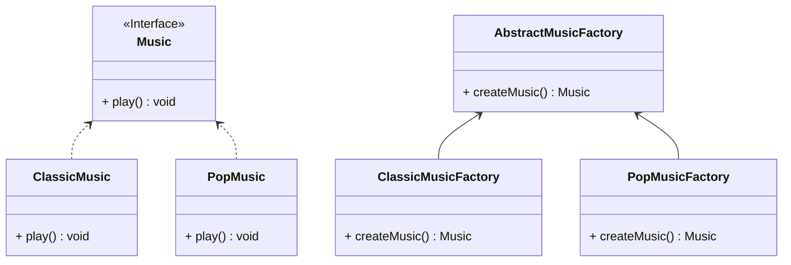
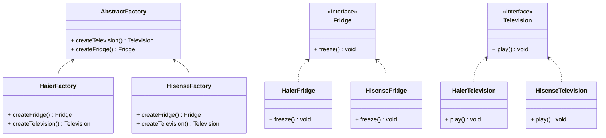

# Design Patterns

***Use Java to implement design patterns***

参考书籍 [*Refactoring and Design Patterns*](https://refactoring.guru/)


# 相关概念

## 面向对象程序设计

- 抽象：对真实世界对象的特定属性和动作进行建模
- 封装：隐藏对象自身部分属性和行为，只对外暴露部分内容
- 继承：根据已有类创建新类，实现代码复用
- 多态：根据对象所继承的父类，调用其子类具体实现的能力


## 对象之间的关系

- 依赖：最基础、最微弱的关系，如类中使用其他类的方法
- 关联：一个对象使用另一个对象(永久性联系)，如类成员变量
- 聚合：一个对象”包含“一组其他对象，并扮演着容器的角色
- 组合：一种特殊的聚合，组合中的组件不能单独存在，而聚合中的组件可以单独存在
- 实现：类class实现接口interface中定义的方法
- 继承：类class继承父类superclass的接口和实现，并且可以进行拓展


## 软件设计原则

- 代码复用：类、模式、框架
- 扩展性：**变化**是生命中唯一不变的事情
- 封装性：将程序中不变的内容封装起来
- 面向接口进行开发，而不是面向实现
- 依赖于抽象类型，而不是具体类
- 组合优于继承，继承是”是“关系，组合是”有“关系


## SOLID原则

- 单一职责原则(每个类只负责软件中的一个功能)

- 开闭原则(一个类要鼓励”拓展“，拒绝”修改“)

- 里氏替换原则(子类必须保持与父类行为的兼容)

- 接口隔离原则(尽量缩小接口的范围，避免实现不必要的行为)

- 依赖倒置原则(低层次的类依赖于高层次的抽象)

  

**里氏替换原则补充**

- 子类方法参数类型必须比其超类的参数类型相匹配或更加抽象
- 子类方法的返回值类型必须与超类方法的返回值类型或是其子类别相匹配
- 子类中的方法不应抛出基础方法预期之外的异常类型
- 子类不应该加强其前置条件(父类允许int，子类只要正数)
- 子类不能削弱其后置条件
- 超类的不变量必须保留
- 子类不能修改超类中私有成员变量的值

  

## 设计模式

**设计模式**是软件设计中常见问题的典型解决方案。 它们就像能根据需求进行调整的预制蓝图， 可用于解决代码中反复出现的设计问题。

- 创建型模式：提供创建对象的机制， 增加已有代码的灵活性和可复用性
- 结构型模式：介绍如何将对象和类组装成较大的结构， 并同时保持结构的灵活和高效
- 行为模式：负责对象间的高效沟通和职责委派


# 创建型模式

*创建型模式提供了创建对象的机制， 能够提升已有代码的灵活性和可复用性。*

## 工厂方法

*亦称：虚拟构造函数、Virtual Constructor、Factory Method*

**工厂方法**是一种创建型设计模式，其在父类中提供一个创建对象的方法，允许子类决定实例化对象的类型。



步骤1：创建一个产品接口

```java
public interface Music {
    void play();
}
```

步骤2：创建实现接口的实体类

```java
public class ClassicMusic implements Music {

    @Override
    public void play() {
        System.out.println("Classical music is playing.");
    }
}

public class PopMusic implements Music {

    @Override
    public void play() {
        System.out.println("Pop music is playing.");
    }
}
```

步骤3：创建一个抽象工厂

```java
public abstract class AbstractMusicFactory {
    public abstract Music createMusic();
}
```

步骤4：创建实现抽象工厂的工厂类

```java
public class ClassicMusicFactory extends AbstractMusicFactory {

    @Override
    public Music createMusic() {
        return new ClassicMusic();
    }
}

public class PopMusicFactory extends AbstractMusicFactory {

    @Override
    public Music createMusic() {
        return new PopMusic();
    }
}
```

步骤5：通过工厂获得产品

```java
public class MainApp {
    public static void main(String[] args) {
        ClassicMusicFactory classicMusicFactory = new ClassicMusicFactory();
        classicMusicFactory.createMusic().play();
        PopMusicFactory popMusicFactory = new PopMusicFactory();
        popMusicFactory.createMusic().play();
    }
}
```


## 抽象工厂

*亦称：Abstract Factory*
**抽象工厂**是一种创建型设计模式，它能创建一**系列**相关的对象，而无需指定其具体类。

如需要生产下面4种产品，按照**工厂模式**需要4个不同的工厂，而使用**抽象工厂**，则可以根据品牌进行生产。

| 品牌  | 电视   | 冰箱   |
|-----|------|------|
| 海信  | 海信电视 | 海信冰箱 |
| 海尔  | 海尔电视 | 海尔冰箱 |



步骤1：创建一个电视接口

```java
public interface Television {
    void play();
}
```

步骤2：创建实现电视接口的实体类

```java
public class HisenseTelevision implements Television{

    @Override
    public void play() {
        System.out.println("Hisense TV is playing.");
    }
}

public class HaierTelevision implements Television {

    @Override
    public void play() {
        System.out.println("Haier TV is playing.");
    }
}
```

步骤3：创建一个冰箱接口

```java
public interface Fridge {
    void freeze();
}
```

步骤4：创建实现冰箱接口的实体类

```java
public class HisenseFridge implements Fridge {

    @Override
    public void freeze() {
        System.out.println("Hisense Fridge is freezing.");
    }
}

public class HaierFridge implements Fridge {

    @Override
    public void freeze() {
        System.out.println("Haier Fridge is freezing.");
    }
}
```

步骤5：创建抽象工厂用于制造冰箱和电视。

```java
public abstract class AbstractFactory {
    public abstract Television createTelevision();
    public abstract Fridge createFridge();
}
```

步骤6：各品牌分别实现抽象工厂

```java
public class HisenseFactory extends AbstractFactory {

    @Override
    public Television createTelevision() {
        return new HisenseTelevision();
    }

    @Override
    public Fridge createFridge() {
        return new HisenseFridge();
    }
}

public class HaierFactory extends AbstractFactory {
    @Override
    public Television createTelevision() {
        return new HaierTelevision();
    }

    @Override
    public Fridge createFridge() {
        return new HaierFridge();
    }
}

```

步骤7：通过各品牌工厂获得产品

```Java
public class MainApp {
    public static void main(String[] args) {
        HisenseFactory hisenseFactory = new HisenseFactory();
        hisenseFactory.createTelevision().play();
        hisenseFactory.createFridge().freeze();

        HaierFactory haierFactory = new HaierFactory();
        haierFactory.createTelevision().play();
        haierFactory.createFridge().freeze();
    }
}
```

## 生成器

*亦称：建造者模式、Builder*

**生成器**是一种创建型设计模式，使你能够分步骤创建复杂对象。该模式允许你使用相同的创建代码生成不同类型和形式的对象。
