# Design Patterns

***Use Java to implement design patterns***

参考书籍 [*Refactoring and Design Patterns*](https://refactoring.guru/)


# 相关概念

## 面向对象程序设计

- 抽象：对真实世界对象的特定属性和动作进行建模
- 封装：隐藏对象自身部分属性和行为，只对外暴露部分内容
- 继承：根据已有类创建新类，实现代码复用
- 多态：根据对象所继承的父类，调用其子类具体实现的能力


## 对象之间的关系

- 依赖：最基础、最微弱的关系，如类中使用其他类的方法
- 关联：一个对象使用另一个对象(永久性联系)，如类成员变量
- 聚合：一个对象”包含“一组其他对象，并扮演着容器的角色
- 组合：一种特殊的聚合，组合中的组件不能单独存在，而聚合中的组件可以单独存在
- 实现：类class实现接口interface中定义的方法
- 继承：类class继承父类superclass的接口和实现，并且可以进行拓展


## 软件设计原则

- 代码复用：类、模式、框架
- 扩展性：**变化**是生命中唯一不变的事情
- 封装性：将程序中不变的内容封装起来
- 面向接口进行开发，而不是面向实现
- 依赖于抽象类型，而不是具体类
- 组合优于继承，继承是”是“关系，组合是”有“关系


## SOLID原则

- 单一职责原则(每个类只负责软件中的一个功能)

- 开闭原则(一个类要鼓励”拓展“，拒绝”修改“)

- 里氏替换原则(子类必须保持与父类行为的兼容)

- 接口隔离原则(尽量缩小接口的范围，避免实现不必要的行为)

- 依赖倒置原则(低层次的类依赖于高层次的抽象)

  

**里氏替换原则补充**

- 子类方法参数类型必须比其超类的参数类型相匹配或更加抽象
- 子类方法的返回值类型必须与超类方法的返回值类型或是其子类别相匹配
- 子类中的方法不应抛出基础方法预期之外的异常类型
- 子类不应该加强其前置条件(父类允许int，子类只要正数)
- 子类不能削弱其后置条件
- 超类的不变量必须保留
- 子类不能修改超类中私有成员变量的值

  

## 设计模式

**设计模式**是软件设计中常见问题的典型解决方案。 它们就像能根据需求进行调整的预制蓝图， 可用于解决代码中反复出现的设计问题。

- 创建型模式：提供创建对象的机制， 增加已有代码的灵活性和可复用性
- 结构型模式：介绍如何将对象和类组装成较大的结构， 并同时保持结构的灵活和高效
- 行为模式：负责对象间的高效沟通和职责委派


# 创建型模式

*创建型模式提供了创建对象的机制， 能够提升已有代码的灵活性和可复用性。*

## 工厂方法

*亦称：虚拟构造函数、Virtual Constructor、Factory Method*

**工厂方法**是一种创建型设计模式，其在父类中提供一个创建对象的方法，允许子类决定实例化对象的类型。

> 如需要制作古典音乐和流行音乐，但是希望创造出来的音乐是属于同一种类的，那么如何来做呢？

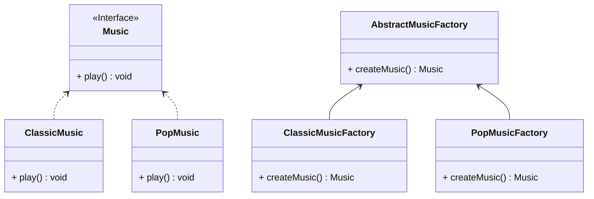

步骤1：创建一个产品接口

```java
public interface Music {
    void play();
}
```

步骤2：创建实现接口的实体类

```java
public class ClassicMusic implements Music {

    @Override
    public void play() {
        System.out.println("Classical music is playing.");
    }
}

public class PopMusic implements Music {

    @Override
    public void play() {
        System.out.println("Pop music is playing.");
    }
}
```

步骤3：创建一个抽象工厂

```java
public abstract class AbstractMusicFactory {
    public abstract Music createMusic();
}
```

步骤4：创建实现抽象工厂的工厂类

```java
public class ClassicMusicFactory extends AbstractMusicFactory {

    @Override
    public Music createMusic() {
        return new ClassicMusic();
    }
}

public class PopMusicFactory extends AbstractMusicFactory {

    @Override
    public Music createMusic() {
        return new PopMusic();
    }
}
```

步骤5：通过工厂获得产品

```java
public class MainApp {
    public static void main(String[] args) {
        ClassicMusicFactory classicMusicFactory = new ClassicMusicFactory();
        classicMusicFactory.createMusic().play();
        PopMusicFactory popMusicFactory = new PopMusicFactory();
        popMusicFactory.createMusic().play();
    }
}
```


## 抽象工厂

*亦称：Abstract Factory*
**抽象工厂**是一种创建型设计模式，它能创建一**系列**相关的对象，而无需指定其具体类。

> 如需要生产下面4种产品，按照**工厂模式**需要4个不同的工厂，而使用**抽象工厂**，则可以根据品牌进行生产。

| 品牌  | 电视   | 冰箱   |
|-----|------|------|
| 海信  | 海信电视 | 海信冰箱 |
| 海尔  | 海尔电视 | 海尔冰箱 |


步骤1：创建一个电视接口

```java
public interface Television {
    void play();
}
```

步骤2：创建实现电视接口的实体类

```java
public class HisenseTelevision implements Television{

    @Override
    public void play() {
        System.out.println("Hisense TV is playing.");
    }
}

public class HaierTelevision implements Television {

    @Override
    public void play() {
        System.out.println("Haier TV is playing.");
    }
}
```

步骤3：创建一个冰箱接口

```java
public interface Fridge {
    void freeze();
}
```

步骤4：创建实现冰箱接口的实体类

```java
public class HisenseFridge implements Fridge {

    @Override
    public void freeze() {
        System.out.println("Hisense Fridge is freezing.");
    }
}

public class HaierFridge implements Fridge {

    @Override
    public void freeze() {
        System.out.println("Haier Fridge is freezing.");
    }
}
```

步骤5：创建抽象工厂用于制造冰箱和电视。

```java
public abstract class AbstractFactory {
    public abstract Television createTelevision();
    public abstract Fridge createFridge();
}
```

步骤6：各品牌分别实现抽象工厂

```java
public class HisenseFactory extends AbstractFactory {

    @Override
    public Television createTelevision() {
        return new HisenseTelevision();
    }

    @Override
    public Fridge createFridge() {
        return new HisenseFridge();
    }
}

public class HaierFactory extends AbstractFactory {
    @Override
    public Television createTelevision() {
        return new HaierTelevision();
    }

    @Override
    public Fridge createFridge() {
        return new HaierFridge();
    }
}

```

步骤7：通过各品牌工厂获得产品

```Java
public class MainApp {
    public static void main(String[] args) {
        HisenseFactory hisenseFactory = new HisenseFactory();
        hisenseFactory.createTelevision().play();
        hisenseFactory.createFridge().freeze();

        HaierFactory haierFactory = new HaierFactory();
        haierFactory.createTelevision().play();
        haierFactory.createFridge().freeze();
    }
}
```


## 生成器

*亦称：建造者模式、Builder*

**生成器**是一种创建型设计模式，使你能够分步骤创建复杂对象。该模式允许你使用相同的创建代码生成不同类型和形式的对象。

> 如需要生产一辆汽车🚗，汽车有各种各样的配件(名称、引擎、座位数、是否是敞篷等等)，如果我们采用构造函数来生成对象，需要利用**overload**写各种各样类型的构造函数，利用**生成器**模式可以实现分步骤装配。

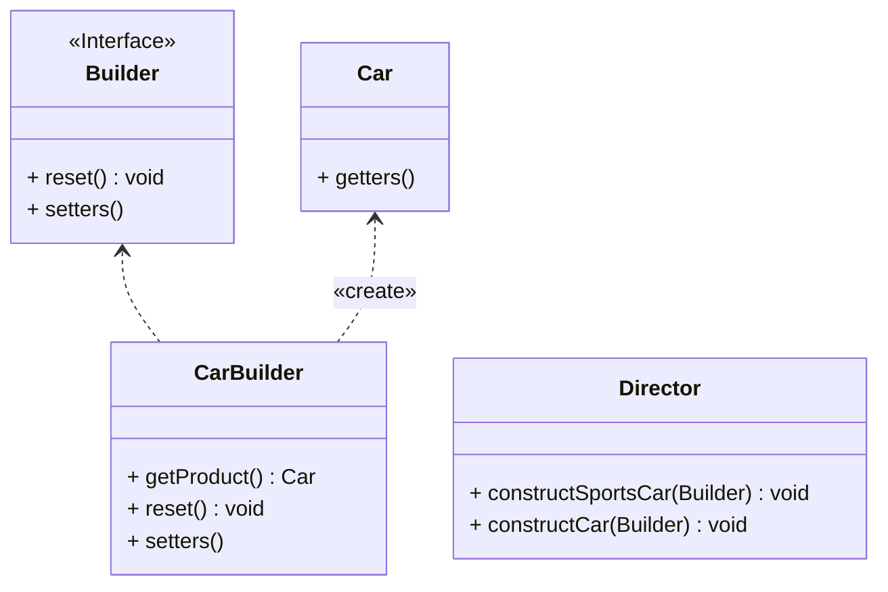

步骤1：创建一个汽车实体类

```java
public class Car {
    private final String name;
    private final int seats;
    private final String engine;
    private final boolean sunroof;

    public Car() {
        this.name = "Default Name";
        this.seats = 4;
        this.engine = "Default Engine";
        this.sunroof = false;
    }

    public Car(String name, int seats, String engine, boolean sunroof) {
        this.name = name;
        this.seats = seats;
        this.engine = engine;
        this.sunroof = sunroof;
    }
    // getters has been omitted.
}
```

步骤2：根据汽车的配置创建生成器接口

```java
public interface Builder {
	 
    void reset();
    Builder setName(String name);
    Builder setSeats(int quantity);
    Builder setEngine(String name);
    Builder setSunroof(boolean install);
}
```

步骤3：创建实现生成器接口的汽车实体类

```java
public class CarBuilder implements Builder {
    private String name;
    private int seats;
    private String engine;
    private boolean sunroof;

    public Car getProduct() {
        Car car = new Car(this.name, this.seats, this.engine, this.sunroof);
        this.reset();
        return car;
    }

    @Override
    public void reset() {
        Car car = new Car();
        this.name = car.getName();
        this.seats = car.getSeats();
        this.engine = car.getEngine();
        this.sunroof = car.isSunroof();
    }

    @Override
    public Builder setName(String name) {
        this.name = name;
        return this;
    }

    @Override
    public Builder setSeats(int seats) {
        this.seats = seats;
        return this;
    }

    @Override
    public Builder setEngine(String engine) {
        this.engine = engine;
        return this;
    }

    @Override
    public Builder setSunroof(boolean sunroof) {
        this.sunroof = sunroof;
        return this;
    }

}
```

步骤4：创建一个主管类(可选)，用来指挥生成器工作

```java
public class Director {

    public void constructSportsCar(Builder builder) {
        builder.setName("Sports Car")
                .setSeats(2)
                .setEngine("Engine A")
                .setSunroof(true);
    }

    public void constructCar(Builder builder) {
        builder.setName("Car")
                .setSeats(4)
                .setEngine("Common Engine")
                .setSunroof(false);
    }
}
```

步骤5：通过主管和生成器类实现制造和自定义汽车🚗

```java
public class MainApp {
    public static void main(String[] args) {
        Director director = new Director();
        CarBuilder carBuilder = new CarBuilder();

        director.constructSportsCar(carBuilder);
        Car car = carBuilder.getProduct();
        System.out.println(car);

        director.constructCar(carBuilder);
        car = carBuilder.getProduct();
        System.out.println(car);

        carBuilder.setName("Ruobing").setSunroof(true).setSeats(8);
        car = carBuilder.getProduct();
        System.out.println(car);
    }
}
```


## 原型

*亦称：克隆、Clone、Prototype*

**原型**是一种创建型设计模式，使你能够复制已有对象，而又无需使代码依赖它们所属的类。

> 如需要根据对象来克隆一个相同的对象，但是又不想了解其所属的类别，克隆是一把好手。

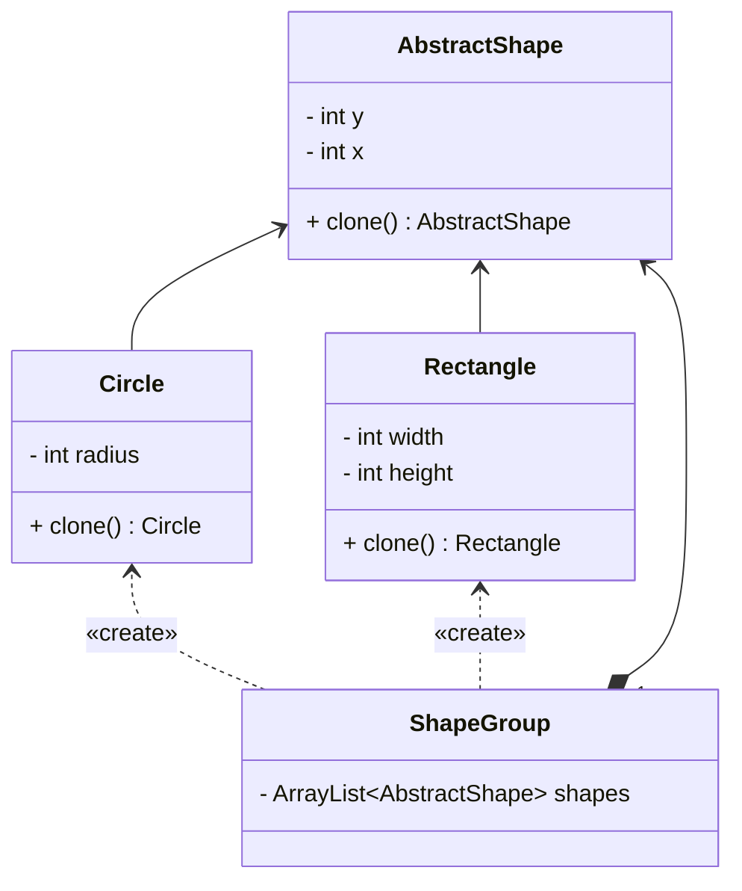

步骤1：创建一个抽象父类，在其中定义一个抽象clone方法

```java
public abstract class AbstractShape {
    private int x;
    private int y;

    public AbstractShape() {
    }

    public AbstractShape(AbstractShape source) {
        this.x = source.x;
        this.y = source.y;
    }

    @Override
    public abstract AbstractShape clone();

    public void setX(int x) {
        this.x = x;
    }

    public void setY(int y) {
        this.y = y;
    }

}
```

步骤2：创建继承于抽象类的实体类，重点其可以根据当前对象创建一个新对象。

> 具体实现于有参构造函数(注意需要继承父类的属性)和clone方法

```java
public class Circle extends AbstractShape {
    private int radius;

    public Circle() {
    }

    public Circle(Circle source) {
        super(source);
        this.radius = source.radius;
    }

    @Override
    public Circle clone() {
        return new Circle(this);
    }

    public void setRadius(int radius) {
        this.radius = radius;
    }

    @Override
    public String toString() {
        return "Circle{" +
                "radius=" + radius +
                '}';
    }
}
```

步骤3：可以创建一个**原型组**在其中初始化一系列原型(可选)

```java
public class ShapeGroup {
    private final ArrayList<AbstractShape> shapes = new ArrayList<>();

    public ShapeGroup() {
        Circle circle = new Circle();
        circle.setX(10);
        circle.setY(10);
        circle.setRadius(20);
        shapes.add(circle);

        Rectangle rectangle = new Rectangle();
        rectangle.setWidth(10);
        rectangle.setHeight(20);
        shapes.add(rectangle);
    }

    public ArrayList<AbstractShape> getShapes() {
        return shapes;
    }
}
```

步骤4：使用原型进行克隆

```java
public class MainApp {

    public static void main(String[] args) {
        ShapeGroup shapeGroup = new ShapeGroup();
        ArrayList<AbstractShape> shapes = shapeGroup.getShapes();
        ArrayList<AbstractShape> shapesCopy = new ArrayList<>();

        for (AbstractShape shape : shapes) {
            shapesCopy.add(shape.clone());
        }
        shapes.forEach(System.out::println);
        shapesCopy.forEach(System.out::println);
    }
}
```


## 单例

*亦称：单件模式、Singleton*

**单例**是一种创建型设计模式，让你能够保证一个类只有一个实例，并提供一个访问该实例的全局节点。

> 如果你的系统中只想拥有某个类的一个实例，并且这个实例是全局可用的，那么单例是最适合的解决方案。

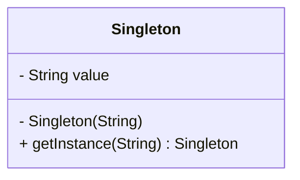

步骤1：创建一个单例类

> - 构造函数必须是private的，且instance必须是一个类变量
> - 同时提供一个名为getInstance的类方法对外暴露出实例
> - 注意thread-safe、懒汉/饿汉模式

```java
public final class Singleton {
    /**
     * The field must be declared volatile 
     * so that double check lock would work correctly.
     */
    private static volatile Singleton instance;
    private final String value;

    private Singleton(String value) {
        this.value = value;
    }

    /**
     * double-checked locking (DCL)
     * threads safe
     */
    public static Singleton getInstance(String value) {
        if (instance != null) {
            return instance;
        }
        synchronized (Singleton.class) {
            if (instance == null) {
                instance = new Singleton(value);
            }
            return instance;
        }
    }

    public String getValue() {
        return value;
    }
}
```

步骤2：使用单例

> 注意两个instance的地址是相同的，说明他们是同一个instance，也就是**单例**

```java
public class MainApp {
    public static void main(String[] args) {
        Singleton instance = Singleton.getInstance("instance No.1");
        System.out.println(instance);
        System.out.println(instance.getValue());

        // The obtained instance is still instance No.1, 
        // and they have the same memory address.
        instance = Singleton.getInstance("instance No.2");
        System.out.println(instance);
        System.out.println(instance.getValue());
    }
}
```

# 结构型模式

*结构型模式介绍如何将对象和类组装成较大的结构，并同时保持结构的灵活和高效。*

## 适配器

*亦称：封装器模式、Wrapper、Adapter*

**适配器**是一种结构型设计模式，它能使接口不兼容的对象能够相互合作。

> 如果你去到美国，但是你的手机却需要220V的电压充电，那么不错的方法就是适配美国110V的电压。

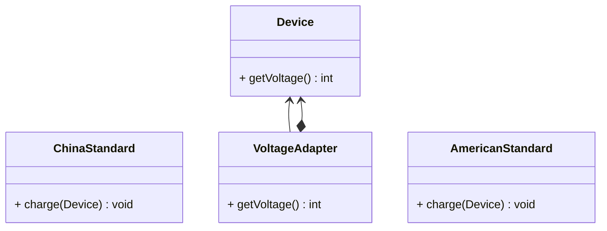
步骤1：创建中国和美国的电压标准实体类

```java
public class ChinaStandard {
    private final static int VOLTAGE = 220;

    public static void charge(Device device) {
        if (VOLTAGE >= device.getVoltage()) {
            System.out.println("charging...");
        } else {
            System.out.println(VOLTAGE + "V and " + device.getVoltage() + "V are incompatible!");
        }
    }
}

public class AmericanStandard {
    private final static int VOLTAGE = 110;

    public static void charge(Device device) {
        if (VOLTAGE >= device.getVoltage()) {
            System.out.println("charging...");
        } else {
            System.out.println(VOLTAGE + "V and " + device.getVoltage() + "V are incompatible!");
        }
    }
}
```

步骤2：创建一台中国制造的设备(充电电压220V)

```java
public class Device {
    private final static int VOLTAGE = 220;

    public int getVoltage() {
        return VOLTAGE;
    }
}
```

步骤3：创建一个电压适配器用于适应美国标准的电压

> 需要继承于设备，通常使用一个设备的实例作为成员变量

```java
public class VoltageAdapter extends Device {
    private final Device device;

    public VoltageAdapter(Device device) {
        this.device = device;
    }

    @Override
    public int getVoltage() {
        return this.device.getVoltage() / 2;
    }
}
```

步骤4：中国设备成功在美国充上电

```java
public class MainApp {
    public static void main(String[] args) {
        Device device = new Device();
        ChinaStandard.charge(device);
        AmericanStandard.charge(device);

        VoltageAdapter adapter = new VoltageAdapter(device);
        ChinaStandard.charge(adapter);
        AmericanStandard.charge(adapter);
    }
}
```


## 桥接

*亦称：Bridge*

**桥接**是一种结构型设计模式，可将一个大类或一系列紧密相关的类拆分为抽象和实现两个独立的层次结构，从而能在开发时分别使用。

> 如果拥有设备和遥控两个对象，如果使用继承容易导致维度灾难，使用桥接可以将其抽象与实现分离。

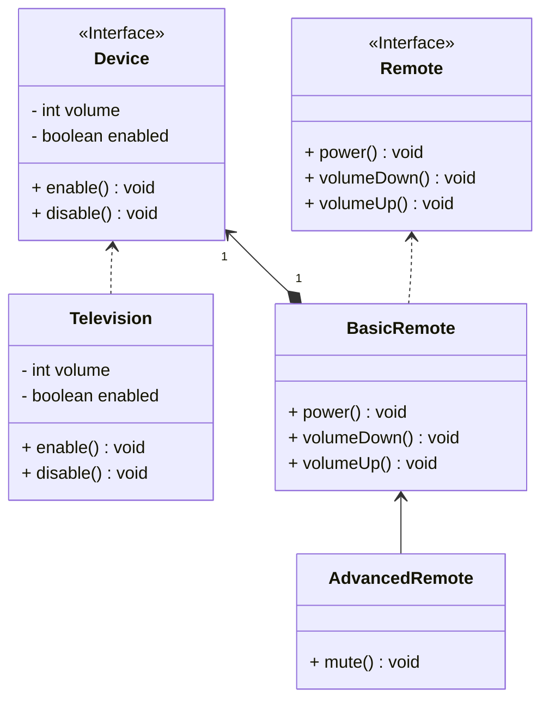

步骤1：创建一个设备接口，所有具体设备都必须实现它

```java
public interface Device {
    boolean isEnabled();

    void enable();

    void disable();

    int getVolume();

    void setVolume(int volume);
}
```

步骤2：创建一台具体的设备

```java
public class Television implements Device {
    private boolean on = false;
    private int volume = 30;

    @Override
    public boolean isEnabled() {
        return on;
    }

    @Override
    public void enable() {
        on = true;
    }

    @Override
    public void disable() {
        on = false;
    }

    @Override
    public int getVolume() {
        return volume;
    }

    @Override
    public void setVolume(int volume) {
        this.volume = volume;
    }
}
```

步骤3：创建一个遥控器接口，所有具体遥控器都必须实现它

> 需要继承于设备，通常使用一个设备的实例作为成员变量

```java
public interface Remote {
    void power();

    void volumeDown();

    void volumeUp();
}
```

步骤4：创建一个的具体遥控器

> 通过类变量device来实现操控功能

```java
public class BasicRemote implements Remote {
    protected Device device;

    public BasicRemote(Device device) {
        this.device = device;
    }

    @Override
    public void power() {
        if (device.isEnabled()) {
            device.disable();
        } else {
            device.enable();
        }
    }

    @Override
    public void volumeDown() {
        device.setVolume(device.getVolume() - 10);
    }

    @Override
    public void volumeUp() {
        device.setVolume(device.getVolume() + 10);
    }
}
```
步骤5：此时再创建一个高级遥控器，可以实现自定义功能

```java
public class AdvancedRemote extends BasicRemote {
    public AdvancedRemote(Device device) {
        super(device);
    }

    public void mute() {
        device.setVolume(0);
    }
}
```

步骤6：使用桥接，避免了继承的组合爆炸，同时成功将抽象与实现分离开

```java
public class MainApp {
    public static void main(String[] args) {
        Television tv=new Television();
        System.out.println(tv.getVolume());
        
        BasicRemote basicRemote=new BasicRemote(tv);
        basicRemote.volumeDown();
        System.out.println(tv.getVolume());
        
        AdvancedRemote advancedRemote=new AdvancedRemote(tv);
        advancedRemote.mute();
        System.out.println(tv.getVolume());
    }
}
```


## 组合

*亦称：对象树、Object Tree、Composite*

**组合**是一种结构型设计模式，你可以使用它将对象组合成树状结构，并且能像使用独立对象一样使用它们。

> 如果你想描述形如**菜单、子菜单、菜单项**这样的树状结构，使用组合是不错的主意。

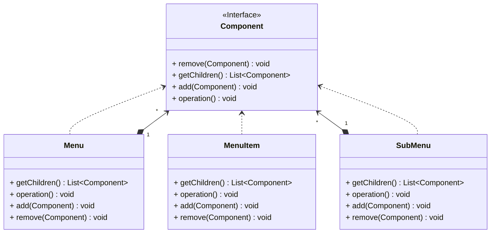

步骤1：创建一个组件接口

> 把一组相似的对象抽象为一个对象

```java
public interface Component {
    void add(Component component);

    void remove(Component component);

    List<Component> getChildren();

    void operation();
}
```

步骤2：每个层级的对象以不同的方式实现组件接口

> 可以考虑使用继承来复用代码，但需要注意成员变量冗余的问题

```java
public class Menu implements Component {
    private final String name;
    private final List<Component> children = new ArrayList<>();

    public Menu(String name) {
        this.name = name;
    }

    @Override
    public void add(Component component) {
        children.add(component);
    }

    @Override
    public void remove(Component component) {
        component.remove(component);
    }

    @Override
    public List<Component> getChildren() {
        return children;
    }

    @Override
    public void operation() {
        System.out.println(name);
        for (Component child : children) {
            child.operation();
        }
    }
}

public class SubMenu implements Component{
    private final String name;
    private final List<Component> children = new ArrayList<>();

    public SubMenu(String name) {
        this.name = name;
    }

    @Override
    public void add(Component component) {
        children.add(component);
    }

    @Override
    public void remove(Component component) {
        component.remove(component);
    }

    @Override
    public List<Component> getChildren() {
        return children;
    }

    @Override
    public void operation() {
        System.out.println("\t"+name);
        for (Component child : children) {
            child.operation();
        }
    }
}

public class MenuItem implements Component {
    private final String name;

    public MenuItem(String name) {
        this.name = name;
    }

    @Override
    public void add(Component component) {
    }

    @Override
    public void remove(Component component) {
    }

    @Override
    public List<Component> getChildren() {
        return null;
    }

    @Override
    public void operation() {
        System.out.println("\t\t" + name);
    }
}
```
步骤3：使用组合来打印出每一个菜单项目

```java
public class MainApp {
    public static void main(String[] args) {
        SubMenu subMenu = new SubMenu("SubMenu A");
        subMenu.add(new MenuItem("MenuItem A"));
        subMenu.add(new MenuItem("MenuItem B"));
        subMenu.add(new MenuItem("MenuItem C"));

        Menu menu = new Menu("Menu A");
        menu.add(subMenu);
        menu.operation();
    }
}
```


## 装饰

*亦称：装饰者模式、装饰器模式、Wrapper、Decorator*

**装饰**是一种结构型设计模式，允许你通过将对象放入包含行为的特殊封装对象中来为原对象绑定新的行为。

若需要复用使用 final 关键字修饰的类，唯一方法是使用装饰模式。

> 如果你有一杯咖啡，你想要往里面加糖加奶，但是又不想拓展咖啡的子类，那么装饰器可以做到这一点。

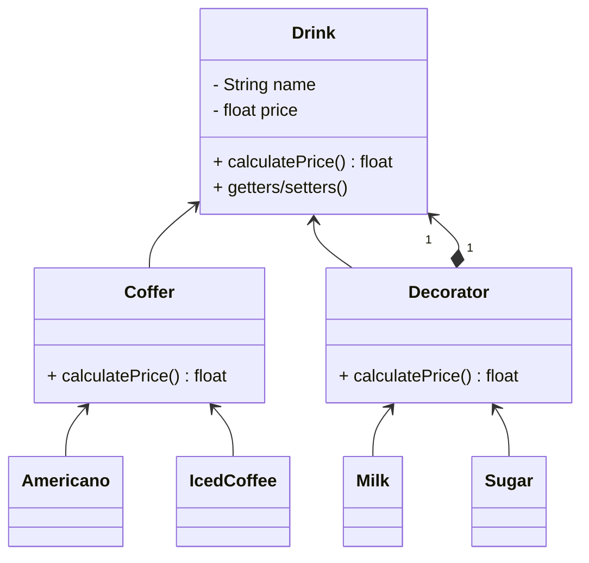

步骤1：创建一个饮料抽象类

```java
public abstract class Drink {
    private String name;
    private float price;
    public abstract float calculatePrice();

    public String getName() {
        return name;
    }

    public void setName(String name) {
        this.name = name;
    }

    public float getPrice() {
        return price;
    }

    public void setPrice(float price) {
        this.price = price;
    }
}
```

步骤2：创建继承于饮料的咖啡类

```java
public class Coffer extends Drink{
    @Override
    public float calculatePrice() {
        return super.getPrice();
    }
}
```

步骤3：创建具体的咖啡类(美式咖啡和冰咖啡)

```java
public class Americano extends Coffer {
    public Americano() {
        setName("Americano");
        setPrice(10);
    }
}

public class IcedCoffee extends Coffer{
    public IcedCoffee() {
        setName("Iced Coffee");
        setPrice(8);
    }
}
```

步骤4：创建继承于饮料的装饰器类

> 通过成员变量drink来完成价格的计算和名称的拼接

```java
public class Decorator extends Drink {
    private final Drink drink;

    public Decorator(Drink drink) {
        this.drink = drink;
    }

    @Override
    public float calculatePrice() {
        return super.getPrice() + drink.calculatePrice();
    }
    
    @Override
    public String getName() {
        return super.getName() + "+" + drink.getName();
    }
}
```

步骤5：创建继承于装饰器的实体类(牛奶和糖)

```java
public class Milk extends Decorator {
    public Milk(Drink drink) {
        super(drink);
        setName("Milk");
        setPrice(2);
    }
}

public class Sugar extends Decorator {
    public Sugar(Drink drink) {
        super(drink);
        setName("Sugar");
        setPrice(1);
    }
}
```

步骤6：使用装饰器来为美式咖啡加糖加奶

```java
public class MainApp {
    public static void main(String[] args) {
        Drink americano = new Americano();
        System.out.println(americano.getName() + "=" + americano.calculatePrice());
        americano = new Milk(americano);
        System.out.println(americano.getName() + "=" + americano.calculatePrice());
        americano = new Sugar(americano);
        System.out.println(americano.getName() + "=" + americano.calculatePrice());
    }
}
```


## 外观

*亦称：Facade*

**外观**是一种结构型设计模式，能为程序库、框架或其他复杂类提供一个简单的接口。

> 如果你有一系列制作早餐的智能设备，如果你希望有一个人能为你操作这些设备，这个“人”就是**外观**。

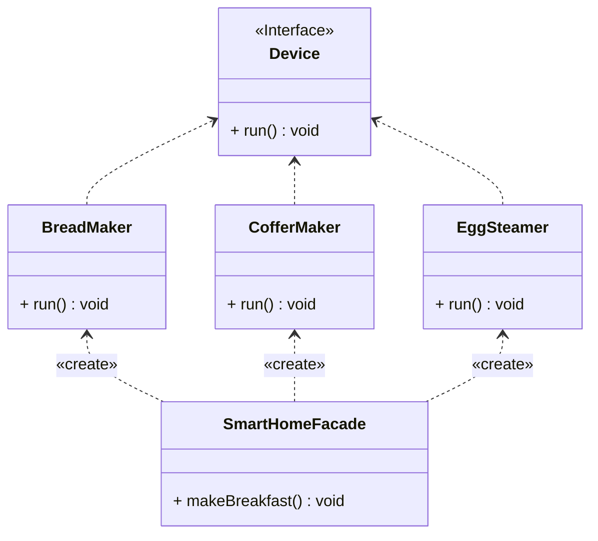

步骤1：创建设备接口，提供设备功能

```java
public interface Device {
    void run();
}
```

步骤2：创建具体的设备实现类(面包机、咖啡机、蒸蛋机)

```java
public class BreadMaker implements Device {
    @Override
    public void run() {
        System.out.println("The BreadMaker is making bread.");
    }
}

public class CofferMaker implements Device {
    @Override
    public void run() {
        System.out.println("The CofferMaker is making coffer.");
    }
}

public class EggSteamer implements Device {
    @Override
    public void run() {
        System.out.println("The EggSteamer is steaming eggs.");
    }
}
```

步骤3：创建外观类，用于托管具体设备实现类

```java
public class SmartHomeFacade {
    public static void makeBreakfast() {
        System.out.println("The SmartHomeFacade starts making breakfast.");
        BreadMaker breadMaker = new BreadMaker();
        breadMaker.run();
        EggSteamer eggSteamer = new EggSteamer();
        eggSteamer.run();
        CofferMaker cofferMaker = new CofferMaker();
        cofferMaker.run();
        System.out.println("The SmartHomeFacade finished making breakfast.");
    }
}
```

步骤4：通过外观类便捷的做好早餐

```java
public class MainApp {
    public static void main(String[] args) {
        SmartHomeFacade.makeBreakfast();
    }
}
```


## 享元

*亦称：缓存、Cache、Flyweight*

**享元**是一种结构型设计模式，它摒弃了在每个对象中保存所有数据的方式，通过共享多个对象所共有的相同状态，让你能在有限的内存容量中载入更多对象。

> 如果你经营一家自助餐厅，每当客人点菜时，如果厨房有存货就上菜，否则就去制作，这里的“存货”就是**享元**的概念。

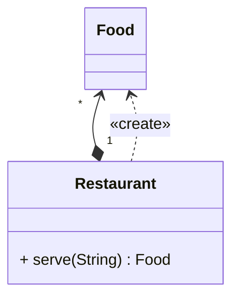

步骤1：创建食物实体类，我们通过打印内存地址来判断是否是同一盘食物。

```java
public class Food {
    private final String name;

    public Food(String name) {
        this.name = name;
    }

    @Override
    public String toString() {
        return name + "@" + Integer.toHexString(hashCode());
    }
}
```

步骤2：使用餐厅类来完成制作和上菜的逻辑

```java
public class Restaurant {
    private static final HashMap<String, Food> foodMap = new HashMap<>();

    public static Food serve(String name) {
        if (foodMap.containsKey(name)) {
            System.out.print("Already owned ");
            return foodMap.get(name);
        }
        System.out.print("Making ");
        Food food = new Food(name);
        foodMap.put(name, food);
        return food;
    }
}
```

步骤3：顾客点菜，餐厅依照秩序工作

```java
public class MainApp {
    public static void main(String[] args) {
        String[] menu = new String[]{"Beef", "Chicken", "Milk", "Beef", "Chicken", "Milk"};
        Arrays.stream(menu).forEach(item -> {
            System.out.print("Ordering " + item + " --> ");
            System.out.println(Restaurant.serve(item));
        });
    }
}
```


## 代理

*亦称：Proxy*

**代理**是一种结构型设计模式，让你能够提供对象的替代品或其占位符。代理控制着对于原对象的访问，并允许在将请求提交给对象前后进行一些处理。

> 如果你不想每次出门购物都带大量现金，那么银行卡(代理)是一个不错的主意。

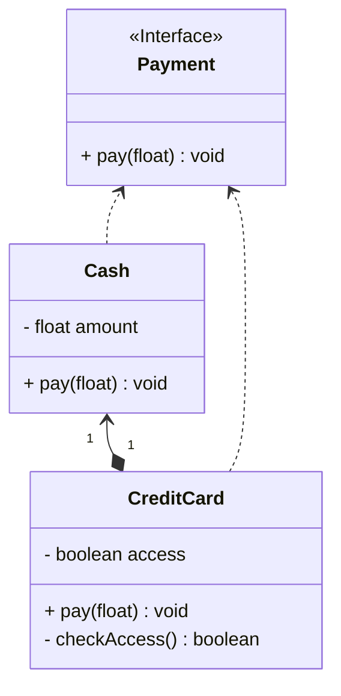

步骤1：创建一个支付接口，实体类和代理都需要实现它

```java
public interface Payment {
    void pay(float price);
}
```

步骤2：创建具体的零钱类，完成支付功能

```java
public class Cash implements Payment {
    private float amount = 100;

    @Override
    public void pay(float price) {
        amount = amount - price;
    }

    public float getAmount() {
        return amount;
    }

    @Override
    public String toString() {
        return "Cash has " + amount + ".";
    }
}
```

步骤3：创建一个代理类(信用卡)，使用它来维护零钱，同时还可以添加“是否可用”功能

```java
public class CreditCard implements Payment {
    private final Cash cash;
    private boolean access = true;

    public CreditCard(Cash cash) {
        this.cash = cash;
    }

    @Override
    public void pay(float price) {
        if (checkAccess()) {
            cash.pay(price);
        } else {
            System.out.println("This CreditCard is not available.");
        }
    }

    private boolean checkAccess() {
        return access;
    }

    public void setAccess(boolean access) {
        this.access = access;
    }

    @Override
    public String toString() {
        return "CreditCard has " + cash.getAmount() + ".";
    }
}
```

步骤4：使用代理类来完成业务逻辑，同时还可以补充一些控制功能

    public class MainApp {
        public static void main(String[] args) {
            CreditCard creditCard = new CreditCard(new Cash());
            creditCard.pay(30);
            System.out.println(creditCard);
            creditCard.setAccess(false);
            // Error! This CreditCard is not available.
            creditCard.pay(10);
        }
    }


# 行为模式

*行为模式负责对象间的高效沟通和职责委派。*

## 责任链

*亦称：职责链模式、命令链、CoR、Chain of Command、Chain of Responsibility*

**责任链**是一种行为设计模式，允许你将请求沿着处理者链进行发送。收到请求后，每个处理者均可对请求进行处理，或将其传递给链上的下个处理者。

> 如果你想实现一个对于不同级别的信息，输出级别是不同的**Logger**，那么可以考虑使用责任链。

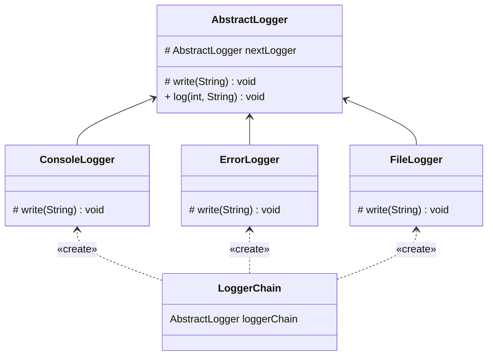

步骤1：创建一个抽象日志类，提供基础的信息和功能

> 注意：成员变量nextLogger负责存储下一个logger的引用地址

```java
public abstract class AbstractLogger {
    public static final int INFO = 1;
    public static final int DEBUG = 2;
    public static final int ERROR = 3;
    protected int level;
    protected AbstractLogger nextLogger;

    public void setNextLogger(AbstractLogger nextLogger) {
        this.nextLogger = nextLogger;
    }

    abstract protected void write(String message);

    public void log(int level, String message) {
        if (this.level <= level) {
            write(message);
        }
        if (nextLogger != null) {
            nextLogger.log(level, message);
        }
    }
}
```

步骤2：创建不同级别的具体日志类

```java
public class ConsoleLogger extends AbstractLogger {

    public ConsoleLogger(int level) {
        this.level = level;
    }

    @Override
    protected void write(String message) {
        System.out.println("Standard Console::Logger: " + message);
    }
}

public class ErrorLogger extends AbstractLogger {

    public ErrorLogger(int level) {
        this.level = level;
    }

    @Override
    protected void write(String message) {
        System.out.println("Error Console::Logger: " + message);
    }
}

public class FileLogger extends AbstractLogger {

    public FileLogger(int level) {
        this.level = level;
    }

    @Override
    protected void write(String message) {
        System.out.println("File::Logger: " + message);
    }
}
```

步骤3：通过成员变量nextLogger将各个logger连接起来

> 可以考虑实现一个addFilter方法来动态添加logger

```java
public class LoggerChain {
    public static AbstractLogger getLoggerChain() {
        AbstractLogger errorLogger = new ErrorLogger(AbstractLogger.ERROR);
        AbstractLogger fileLogger = new FileLogger(AbstractLogger.DEBUG);
        AbstractLogger consoleLogger = new ConsoleLogger(AbstractLogger.INFO);

        errorLogger.setNextLogger(fileLogger);
        fileLogger.setNextLogger(consoleLogger);
        return errorLogger;
    }
}
```

步骤4：使用责任链来根据不同级别的信息，输出不同的日志记录

```java
public class MainApp {
    public static void main(String[] args) {
        AbstractLogger logger = LoggerChain.getLoggerChain();

        logger.log(AbstractLogger.INFO, "This is an information.");

        logger.log(AbstractLogger.DEBUG, "This is a debug level information.");

        logger.log(AbstractLogger.ERROR, "This is an error information.");
    }
}
```


## 命令

*亦称：动作、事务、Action、Transaction、Command*

**命令**是一种行为设计模式，它可将请求转换为一个包含与请求相关的所有信息的独立对象。该转换让你能根据不同的请求将方法参数化、延迟请求执行或将其放入队列中，且能实现可撤销操作。

> 如果你去一家餐厅，你需要直接和厨师交流，你是否会感到奇怪？通过服务员来交流会不会好很多？

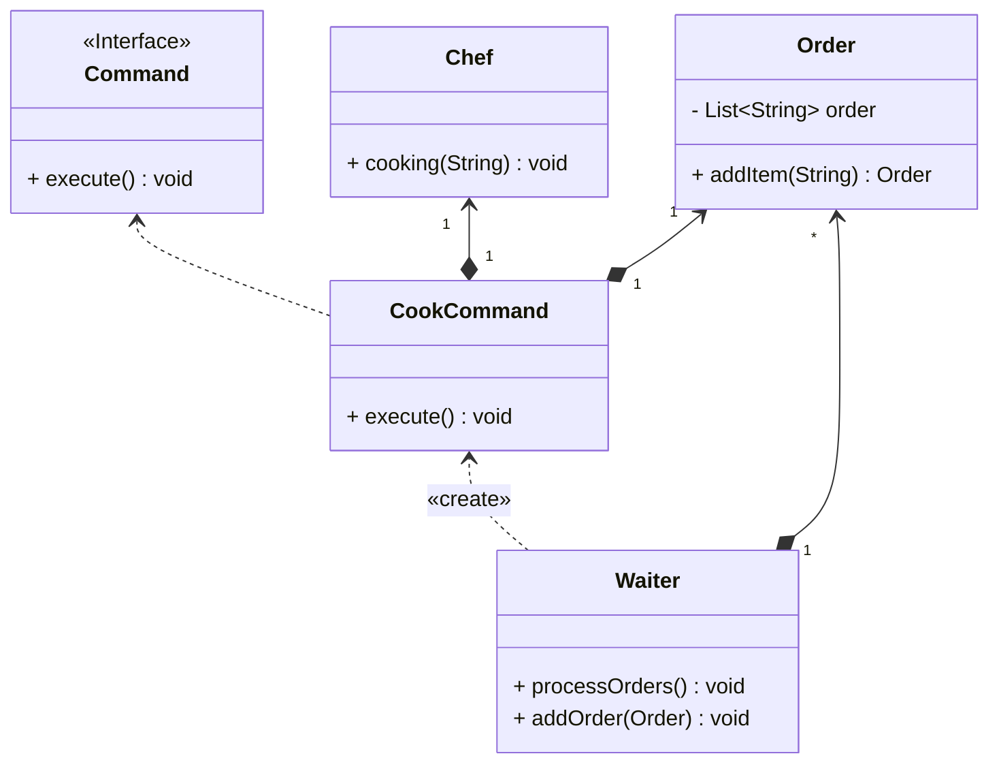

步骤1：创建一个厨师类用于烹饪事物(Receiver)

```java
public class Chef {
    public void cooking(String name) {
        System.out.println("Cooking: " + name);
    }
}
```

步骤2：创建一个订单类，记录顾客点菜

```java
public class Order {
    private final List<String> order = new ArrayList<>();

    public Order addItem(String item) {
        order.add(item);
        return this;
    }

    public List<String> getOrder() {
        return order;
    }
}
```

步骤3：创建一个命令接口

```java
public interface Command {
    void execute();
}
```

步骤4：创建一个烹饪命令类来完成厨师烹饪的任务

```java
public class CookCommand implements Command {
    private final Order order;
    private final Chef chef;

    public CookCommand(Order order) {
        this.order = order;
        this.chef = new Chef();
    }

    @Override
    public void execute() {
        for (String item : order.getOrder()) {
            chef.cooking(item);
        }
    }
}
```

步骤5：创建一个服务员类(Invoker)

> 通过Waiter可以实现Order与Chef的解耦
>
> 可以增加一个历史命令列表，来实现事务的回滚

```java
public class Waiter {
    private final List<CookCommand> cookCommands = new ArrayList<>();

    public void addOrder(Order order) {
        cookCommands.add(new CookCommand(order));
    }

    public void processOrders() {
        for (CookCommand cookCommand:cookCommands) {
            System.out.println("Order processing begins");
            cookCommand.execute();
            System.out.println("Order processing finished");
        }
    }
}
```

步骤6：通过服务员类来进行点菜，避免顾客与厨师的直接沟通

```java
public class MainApp {
    public static void main(String[] args) {
        Waiter waiter = new Waiter();
        Order order = new Order();
        order.addItem("Steak").addItem("Fruit salad").addItem("Corn soup");
        waiter.addOrder(order);

        order = new Order();
        order.addItem("Pork chops").addItem("Red wine").addItem("Ice cream");
        waiter.addOrder(order);
        waiter.processOrders();
    }
}
```


## 迭代器

*亦称：Iterator*

**迭代器**是一种行为设计模式，让你能在不暴露集合底层表现形式（列表、栈和树等）的情况下遍历集合中所有的元素。

> 如果你有一个集合类，但是却有各种各样的遍历算法(正序、反序、DFS、BFS…)，这些遍历算法最终会和你的集合耦合在一起，你将会很难添加一个新的遍历算法，而且集合类的**主要职责**难道不是高效存储元素吗？为了将**存储**和**遍历**进行**解耦**，我们可以使用**迭代器**来实现。

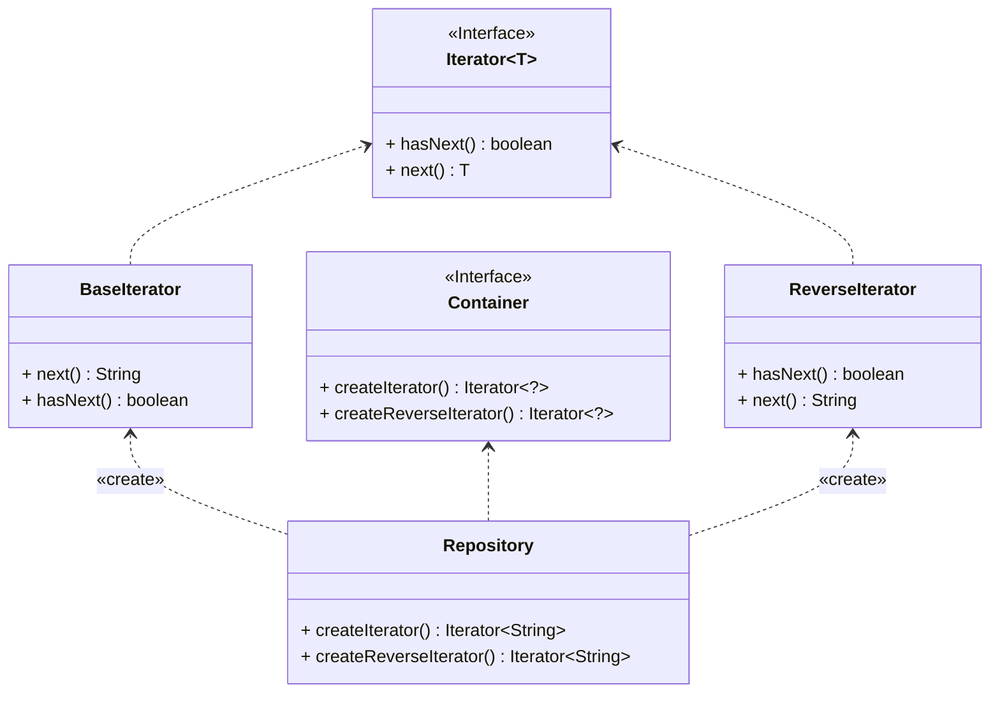

步骤1：创建一个迭代器接口，声明遍历所需的方法

```java
public interface Iterator<T> {
    boolean hasNext();

    T next();
}
```

步骤2：创建一个容器接口，声明获取各种迭代器的方法

```java
public interface Container {
    Iterator<?> createIterator();

    Iterator<?> createReverseIterator();
}
```

步骤3：根据迭代器接口实现各式各样的迭代方法(正序、反序、DFS、BFS…)

```java
public class BaseIterator implements Iterator<String> {
    private final List<String> collection;
    private int index = 0;

    public BaseIterator(List<String> collection) {
        this.collection = collection;
    }

    @Override
    public boolean hasNext() {
        return collection.size() > index;
    }

    @Override
    public String next() {
        String element = collection.get(index);
        index++;
        return element;
    }
}

public class ReverseIterator implements Iterator<String> {
    private final List<String> collection;
    private int index = 0;

    public ReverseIterator(List<String> collection) {
        Collections.reverse(collection);
        this.collection = collection;
    }

    @Override
    public boolean hasNext() {
        return collection.size() > index;
    }

    @Override
    public String next() {
        String element = collection.get(index);
        index++;
        return element;
    }
}
```

步骤4：在一个实现容器接口的实体类中，存储数据结构和返回各式各样的迭代器
```java
public class Repository implements Container {
    private final List<String> collection = new ArrayList<>(Arrays.asList("A", "B", "C", "D"));

    @Override
    public Iterator<String> createIterator() {
        return new BaseIterator(collection);
    }

    @Override
    public Iterator<String> createReverseIterator() {
        return new ReverseIterator(collection);
    }
}
```

步骤5：客户端可以根据获取到的各种迭代器来完成迭代任务

```java
public class MainApp {
    public static void main(String[] args) {
        Repository repository = new Repository();
        Iterator<String> iterator = repository.createIterator();
        System.out.print("Normal  iteration: ");
        while (iterator.hasNext()) {
            System.out.print(iterator.next() + " ");
        }

        System.out.print("\nReverse iteration: ");
        iterator = repository.createReverseIterator();
        while (iterator.hasNext()) {
            System.out.print(iterator.next() + " ");
        }
    }
}
```


## 中介者

*亦称：调解人、控制器、Intermediary、Controller、Mediator*

**中介者**是一种行为设计模式，能让你减少对象之间混乱无序的依赖关系。该模式会限制对象之间的直接交互，迫　使它们通过一个中介者对象进行合作。

> 如果