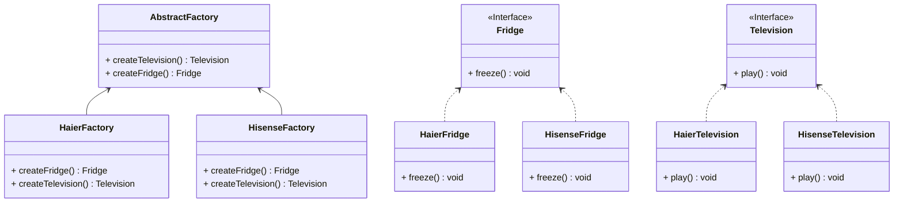

## 抽象工厂

*亦称：Abstract Factory*
**抽象工厂**是一种创建型设计模式，它能创建一**系列**相关的对象，而无需指定其具体类。

> 如需要生产下面4种产品，按照**工厂模式**需要4个不同的工厂，而使用**抽象工厂**，则可以根据品牌进行生产。

| 品牌  | 电视   | 冰箱   |
|-----|------|------|
| 海信  | 海信电视 | 海信冰箱 |
| 海尔  | 海尔电视 | 海尔冰箱 |



步骤1：创建一个电视接口

```java
public interface Television {
    void play();
}
```

步骤2：创建实现电视接口的实体类

```java
public class HisenseTelevision implements Television{

    @Override
    public void play() {
        System.out.println("Hisense TV is playing.");
    }
}

public class HaierTelevision implements Television {

    @Override
    public void play() {
        System.out.println("Haier TV is playing.");
    }
}
```

步骤3：创建一个冰箱接口

```java
public interface Fridge {
    void freeze();
}
```

步骤4：创建实现冰箱接口的实体类

```java
public class HisenseFridge implements Fridge {

    @Override
    public void freeze() {
        System.out.println("Hisense Fridge is freezing.");
    }
}

public class HaierFridge implements Fridge {

    @Override
    public void freeze() {
        System.out.println("Haier Fridge is freezing.");
    }
}
```

步骤5：创建抽象工厂用于制造冰箱和电视。

```java
public abstract class AbstractFactory {
    public abstract Television createTelevision();
    public abstract Fridge createFridge();
}
```

步骤6：各品牌分别实现抽象工厂

```java
public class HisenseFactory extends AbstractFactory {

    @Override
    public Television createTelevision() {
        return new HisenseTelevision();
    }

    @Override
    public Fridge createFridge() {
        return new HisenseFridge();
    }
}

public class HaierFactory extends AbstractFactory {
    @Override
    public Television createTelevision() {
        return new HaierTelevision();
    }

    @Override
    public Fridge createFridge() {
        return new HaierFridge();
    }
}

```

步骤7：通过各品牌工厂获得产品

```Java
public class MainApp {
    public static void main(String[] args) {
        HisenseFactory hisenseFactory = new HisenseFactory();
        hisenseFactory.createTelevision().play();
        hisenseFactory.createFridge().freeze();

        HaierFactory haierFactory = new HaierFactory();
        haierFactory.createTelevision().play();
        haierFactory.createFridge().freeze();
    }
}
```


