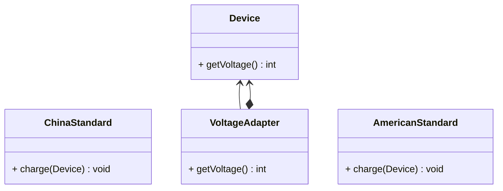

## 适配器

*亦称：封装器模式、Wrapper、Adapter*

**适配器**是一种结构型设计模式，它能使接口不兼容的对象能够相互合作。

> 如果你去到美国，但是你的手机却需要220V的电压充电，那么不错的方法就是适配美国110V的电压。


步骤1：创建中国和美国的电压标准实体类

```java
public class ChinaStandard {
    private final static int VOLTAGE = 220;

    public static void charge(Device device) {
        if (VOLTAGE >= device.getVoltage()) {
            System.out.println("charging...");
        } else {
            System.out.println(VOLTAGE + "V and " + device.getVoltage() + "V are incompatible!");
        }
    }
}

public class AmericanStandard {
    private final static int VOLTAGE = 110;

    public static void charge(Device device) {
        if (VOLTAGE >= device.getVoltage()) {
            System.out.println("charging...");
        } else {
            System.out.println(VOLTAGE + "V and " + device.getVoltage() + "V are incompatible!");
        }
    }
}
```

步骤2：创建一台中国制造的设备(充电电压220V)

```java
public class Device {
    private final static int VOLTAGE = 220;

    public int getVoltage() {
        return VOLTAGE;
    }
}
```

步骤3：创建一个电压适配器用于适应美国标准的电压

> 需要继承于设备，通常使用一个设备的实例作为成员变量

```java
public class VoltageAdapter extends Device {
    private final Device device;

    public VoltageAdapter(Device device) {
        this.device = device;
    }

    @Override
    public int getVoltage() {
        return this.device.getVoltage() / 2;
    }
}
```

步骤4：中国设备成功在美国充上电

```java
public class MainApp {
    public static void main(String[] args) {
        Device device = new Device();
        ChinaStandard.charge(device);
        AmericanStandard.charge(device);

        VoltageAdapter adapter = new VoltageAdapter(device);
        ChinaStandard.charge(adapter);
        AmericanStandard.charge(adapter);
    }
}
```


