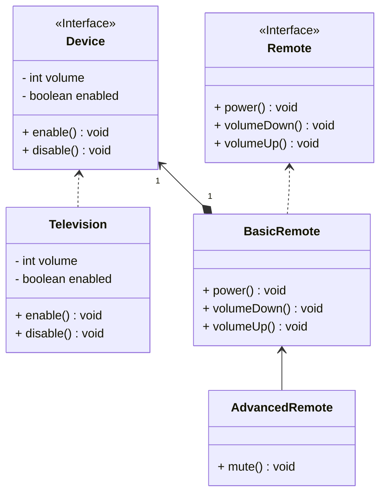

## 桥接

*亦称：Bridge*

**桥接**是一种结构型设计模式，可将一个大类或一系列紧密相关的类拆分为抽象和实现两个独立的层次结构，从而能在开发时分别使用。

> 如果拥有设备和遥控两个对象，如果使用继承容易导致维度灾难，使用桥接可以将其抽象与实现分离。



步骤1：创建一个设备接口，所有具体设备都必须实现它

```java
public interface Device {
    boolean isEnabled();

    void enable();

    void disable();

    int getVolume();

    void setVolume(int volume);
}
```

步骤2：创建一台具体的设备

```java
public class Television implements Device {
    private boolean on = false;
    private int volume = 30;

    @Override
    public boolean isEnabled() {
        return on;
    }

    @Override
    public void enable() {
        on = true;
    }

    @Override
    public void disable() {
        on = false;
    }

    @Override
    public int getVolume() {
        return volume;
    }

    @Override
    public void setVolume(int volume) {
        this.volume = volume;
    }
}
```

步骤3：创建一个遥控器接口，所有具体遥控器都必须实现它

> 需要继承于设备，通常使用一个设备的实例作为成员变量

```java
public interface Remote {
    void power();

    void volumeDown();

    void volumeUp();
}
```

步骤4：创建一个的具体遥控器

> 通过类变量device来实现操控功能

```java
public class BasicRemote implements Remote {
    protected Device device;

    public BasicRemote(Device device) {
        this.device = device;
    }

    @Override
    public void power() {
        if (device.isEnabled()) {
            device.disable();
        } else {
            device.enable();
        }
    }

    @Override
    public void volumeDown() {
        device.setVolume(device.getVolume() - 10);
    }

    @Override
    public void volumeUp() {
        device.setVolume(device.getVolume() + 10);
    }
}
```
步骤5：此时再创建一个高级遥控器，可以实现自定义功能

```java
public class AdvancedRemote extends BasicRemote {
    public AdvancedRemote(Device device) {
        super(device);
    }

    public void mute() {
        device.setVolume(0);
    }
}
```

步骤6：使用桥接，避免了继承的组合爆炸，同时成功将抽象与实现分离开

```java
public class MainApp {
    public static void main(String[] args) {
        Television tv=new Television();
        System.out.println(tv.getVolume());
        
        BasicRemote basicRemote=new BasicRemote(tv);
        basicRemote.volumeDown();
        System.out.println(tv.getVolume());
        
        AdvancedRemote advancedRemote=new AdvancedRemote(tv);
        advancedRemote.mute();
        System.out.println(tv.getVolume());
    }
}
```


