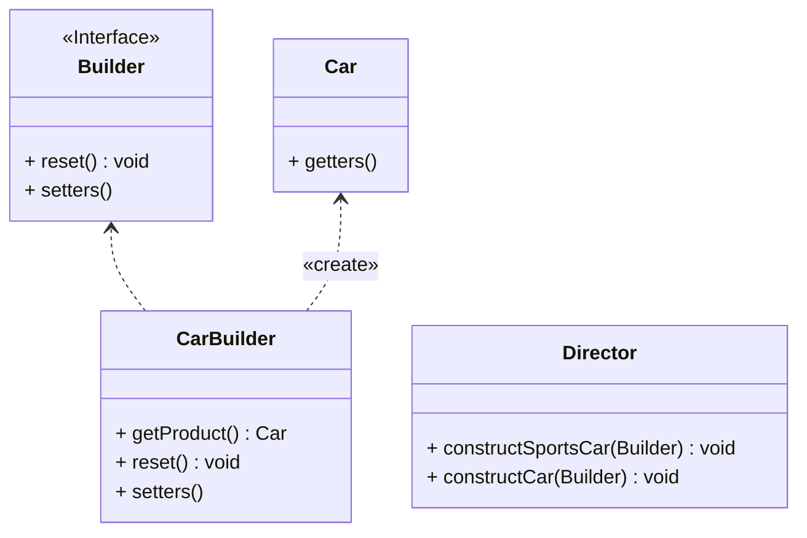

## 生成器

*亦称：建造者模式、Builder*

**生成器**是一种创建型设计模式，使你能够分步骤创建复杂对象。该模式允许你使用相同的创建代码生成不同类型和形式的对象。

> 如需要生产一辆汽车🚗，汽车有各种各样的配件(名称、引擎、座位数、是否是敞篷等等)，如果我们采用构造函数来生成对象，需要利用**overload**写各种各样类型的构造函数，利用**生成器**模式可以实现分步骤装配。



步骤1：创建一个汽车实体类

```java
public class Car {
    private final String name;
    private final int seats;
    private final String engine;
    private final boolean sunroof;

    public Car() {
        this.name = "Default Name";
        this.seats = 4;
        this.engine = "Default Engine";
        this.sunroof = false;
    }

    public Car(String name, int seats, String engine, boolean sunroof) {
        this.name = name;
        this.seats = seats;
        this.engine = engine;
        this.sunroof = sunroof;
    }
    // getters has been omitted.
}
```

步骤2：根据汽车的配置创建生成器接口

```java
public interface Builder {
	 
    void reset();
    Builder setName(String name);
    Builder setSeats(int quantity);
    Builder setEngine(String name);
    Builder setSunroof(boolean install);
}
```

步骤3：创建实现生成器接口的汽车实体类

```java
public class CarBuilder implements Builder {
    private String name;
    private int seats;
    private String engine;
    private boolean sunroof;

    public Car getProduct() {
        Car car = new Car(this.name, this.seats, this.engine, this.sunroof);
        this.reset();
        return car;
    }

    @Override
    public void reset() {
        Car car = new Car();
        this.name = car.getName();
        this.seats = car.getSeats();
        this.engine = car.getEngine();
        this.sunroof = car.isSunroof();
    }

    @Override
    public Builder setName(String name) {
        this.name = name;
        return this;
    }

    @Override
    public Builder setSeats(int seats) {
        this.seats = seats;
        return this;
    }

    @Override
    public Builder setEngine(String engine) {
        this.engine = engine;
        return this;
    }

    @Override
    public Builder setSunroof(boolean sunroof) {
        this.sunroof = sunroof;
        return this;
    }

}
```

步骤4：创建一个主管类(可选)，用来指挥生成器工作

```java
public class Director {

    public void constructSportsCar(Builder builder) {
        builder.setName("Sports Car")
                .setSeats(2)
                .setEngine("Engine A")
                .setSunroof(true);
    }

    public void constructCar(Builder builder) {
        builder.setName("Car")
                .setSeats(4)
                .setEngine("Common Engine")
                .setSunroof(false);
    }
}
```

步骤5：通过主管和生成器类实现制造和自定义汽车🚗

```java
public class MainApp {
    public static void main(String[] args) {
        Director director = new Director();
        CarBuilder carBuilder = new CarBuilder();

        director.constructSportsCar(carBuilder);
        Car car = carBuilder.getProduct();
        System.out.println(car);

        director.constructCar(carBuilder);
        car = carBuilder.getProduct();
        System.out.println(car);

        carBuilder.setName("Ruobing").setSunroof(true).setSeats(8);
        car = carBuilder.getProduct();
        System.out.println(car);
    }
}
```


