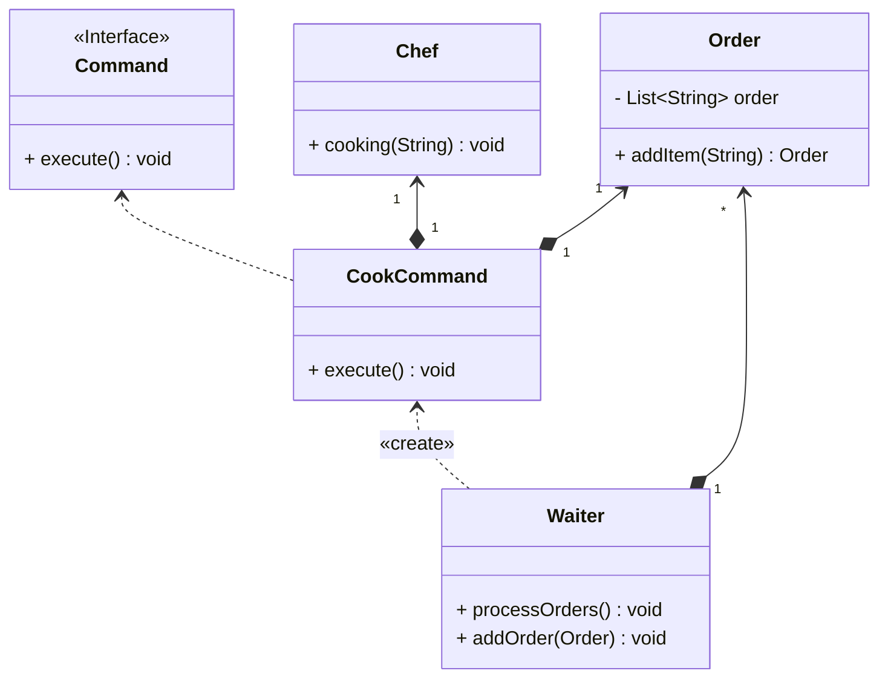

## 命令

*亦称：动作、事务、Action、Transaction、Command*

**命令**是一种行为设计模式，它可将请求转换为一个包含与请求相关的所有信息的独立对象。该转换让你能根据不同的请求将方法参数化、延迟请求执行或将其放入队列中，且能实现可撤销操作。

> 如果你去一家餐厅，你需要直接和厨师交流，你是否会感到奇怪？通过服务员来交流会不会好很多？



步骤1：创建一个厨师类用于烹饪食物(Receiver)

```java
public class Chef {
    public void cooking(String name) {
        System.out.println("Cooking: " + name);
    }
}
```

步骤2：创建一个订单类，记录顾客点菜

```java
public class Order {
    private final List<String> order = new ArrayList<>();

    public Order addItem(String item) {
        order.add(item);
        return this;
    }

    public List<String> getOrder() {
        return order;
    }
}
```

步骤3：创建一个命令接口

```java
public interface Command {
    void execute();
}
```

步骤4：创建一个烹饪命令类来完成厨师烹饪的任务

```java
public class CookCommand implements Command {
    private final Order order;
    private final Chef chef;

    public CookCommand(Order order) {
        this.order = order;
        this.chef = new Chef();
    }

    @Override
    public void execute() {
        for (String item : order.getOrder()) {
            chef.cooking(item);
        }
    }
}
```

步骤5：创建一个服务员类(Invoker)

> 通过Waiter可以实现Order与Chef的解耦
>
> 可以增加一个历史命令列表，来实现事务的回滚

```java
public class Waiter {
    private final List<CookCommand> cookCommands = new ArrayList<>();

    public void addOrder(Order order) {
        cookCommands.add(new CookCommand(order));
    }

    public void processOrders() {
        for (CookCommand cookCommand:cookCommands) {
            System.out.println("Order processing begins");
            cookCommand.execute();
            System.out.println("Order processing finished");
        }
    }
}
```

步骤6：通过服务员类来进行点菜，避免顾客与厨师的直接沟通

```java
public class MainApp {
    public static void main(String[] args) {
        Waiter waiter = new Waiter();
        Order order = new Order();
        order.addItem("Steak").addItem("Fruit salad").addItem("Corn soup");
        waiter.addOrder(order);

        order = new Order();
        order.addItem("Pork chops").addItem("Red wine").addItem("Ice cream");
        waiter.addOrder(order);
        waiter.processOrders();
    }
}
```


