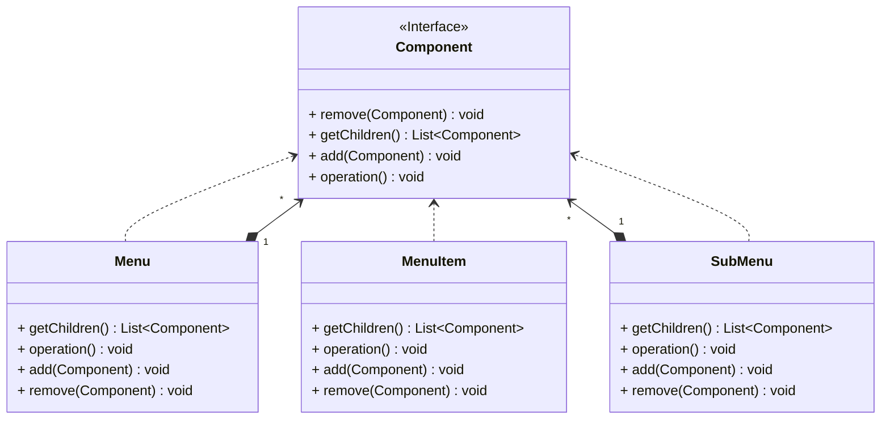

## 组合

*亦称：对象树、Object Tree、Composite*

**组合**是一种结构型设计模式，你可以使用它将对象组合成树状结构，并且能像使用独立对象一样使用它们。

> 如果你想描述形如**菜单、子菜单、菜单项**这样的树状结构，使用组合是不错的主意。



步骤1：创建一个组件接口

> 把一组相似的对象抽象为一个对象

```java
public interface Component {
    void add(Component component);

    void remove(Component component);

    List<Component> getChildren();

    void operation();
}
```

步骤2：每个层级的对象以不同的方式实现组件接口

> 可以考虑使用继承来复用代码，但需要注意成员变量冗余的问题

```java
public class Menu implements Component {
    private final String name;
    private final List<Component> children = new ArrayList<>();

    public Menu(String name) {
        this.name = name;
    }

    @Override
    public void add(Component component) {
        children.add(component);
    }

    @Override
    public void remove(Component component) {
        component.remove(component);
    }

    @Override
    public List<Component> getChildren() {
        return children;
    }

    @Override
    public void operation() {
        System.out.println(name);
        for (Component child : children) {
            child.operation();
        }
    }
}

public class SubMenu implements Component{
    private final String name;
    private final List<Component> children = new ArrayList<>();

    public SubMenu(String name) {
        this.name = name;
    }

    @Override
    public void add(Component component) {
        children.add(component);
    }

    @Override
    public void remove(Component component) {
        component.remove(component);
    }

    @Override
    public List<Component> getChildren() {
        return children;
    }

    @Override
    public void operation() {
        System.out.println("\t"+name);
        for (Component child : children) {
            child.operation();
        }
    }
}

public class MenuItem implements Component {
    private final String name;

    public MenuItem(String name) {
        this.name = name;
    }

    @Override
    public void add(Component component) {
    }

    @Override
    public void remove(Component component) {
    }

    @Override
    public List<Component> getChildren() {
        return null;
    }

    @Override
    public void operation() {
        System.out.println("\t\t" + name);
    }
}
```
步骤3：使用组合来打印出每一个菜单项目

```java
public class MainApp {
    public static void main(String[] args) {
        SubMenu subMenu = new SubMenu("SubMenu A");
        subMenu.add(new MenuItem("MenuItem A"));
        subMenu.add(new MenuItem("MenuItem B"));
        subMenu.add(new MenuItem("MenuItem C"));

        Menu menu = new Menu("Menu A");
        menu.add(subMenu);
        menu.operation();
    }
}
```


