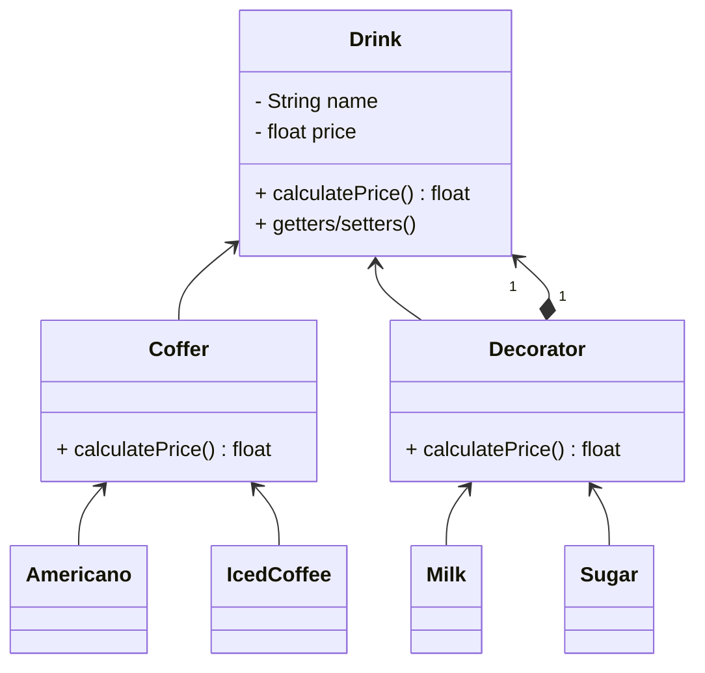

## 装饰

*亦称：装饰者模式、装饰器模式、Wrapper、Decorator*

**装饰**是一种结构型设计模式，允许你通过将对象放入包含行为的特殊封装对象中来为原对象绑定新的行为。

若需要复用使用 final 关键字修饰的类，唯一方法是使用装饰模式。

> 如果你有一杯咖啡，你想要往里面加糖加奶，但是又不想拓展咖啡的子类，那么装饰器可以做到这一点。



步骤1：创建一个饮料抽象类

```java
public abstract class Drink {
    private String name;
    private float price;
    public abstract float calculatePrice();

    public String getName() {
        return name;
    }

    public void setName(String name) {
        this.name = name;
    }

    public float getPrice() {
        return price;
    }

    public void setPrice(float price) {
        this.price = price;
    }
}
```

步骤2：创建继承于饮料的咖啡类

```java
public class Coffer extends Drink{
    @Override
    public float calculatePrice() {
        return super.getPrice();
    }
}
```

步骤3：创建具体的咖啡类(美式咖啡和冰咖啡)

```java
public class Americano extends Coffer {
    public Americano() {
        setName("Americano");
        setPrice(10);
    }
}

public class IcedCoffee extends Coffer{
    public IcedCoffee() {
        setName("Iced Coffee");
        setPrice(8);
    }
}
```

步骤4：创建继承于饮料的装饰器类

> 通过成员变量drink来完成价格的计算和名称的拼接

```java
public class Decorator extends Drink {
    private final Drink drink;

    public Decorator(Drink drink) {
        this.drink = drink;
    }

    @Override
    public float calculatePrice() {
        return super.getPrice() + drink.calculatePrice();
    }
    
    @Override
    public String getName() {
        return super.getName() + "+" + drink.getName();
    }
}
```

步骤5：创建继承于装饰器的实体类(牛奶和糖)

```java
public class Milk extends Decorator {
    public Milk(Drink drink) {
        super(drink);
        setName("Milk");
        setPrice(2);
    }
}

public class Sugar extends Decorator {
    public Sugar(Drink drink) {
        super(drink);
        setName("Sugar");
        setPrice(1);
    }
}
```

步骤6：使用装饰器来为美式咖啡加糖加奶

```java
public class MainApp {
    public static void main(String[] args) {
        Drink americano = new Americano();
        System.out.println(americano.getName() + "=" + americano.calculatePrice());
        americano = new Milk(americano);
        System.out.println(americano.getName() + "=" + americano.calculatePrice());
        americano = new Sugar(americano);
        System.out.println(americano.getName() + "=" + americano.calculatePrice());
    }
}
```


