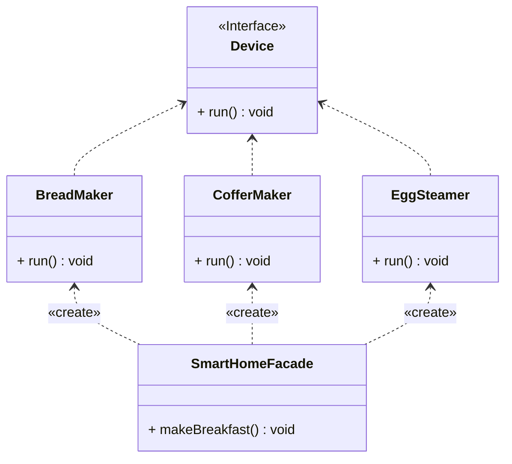

## 外观

*亦称：Facade*

**外观**是一种结构型设计模式，能为程序库、框架或其他复杂类提供一个简单的接口。

> 如果你有一系列制作早餐的智能设备，如果你希望有一个人能为你操作这些设备，这个“人”就是**外观**。



步骤1：创建设备接口，提供设备功能

```java
public interface Device {
    void run();
}
```

步骤2：创建具体的设备实现类(面包机、咖啡机、蒸蛋机)

```java
public class BreadMaker implements Device {
    @Override
    public void run() {
        System.out.println("The BreadMaker is making bread.");
    }
}

public class CofferMaker implements Device {
    @Override
    public void run() {
        System.out.println("The CofferMaker is making coffer.");
    }
}

public class EggSteamer implements Device {
    @Override
    public void run() {
        System.out.println("The EggSteamer is steaming eggs.");
    }
}
```

步骤3：创建外观类，用于托管具体设备实现类

```java
public class SmartHomeFacade {
    public static void makeBreakfast() {
        System.out.println("The SmartHomeFacade starts making breakfast.");
        BreadMaker breadMaker = new BreadMaker();
        breadMaker.run();
        EggSteamer eggSteamer = new EggSteamer();
        eggSteamer.run();
        CofferMaker cofferMaker = new CofferMaker();
        cofferMaker.run();
        System.out.println("The SmartHomeFacade finished making breakfast.");
    }
}
```

步骤4：通过外观类便捷的做好早餐

```java
public class MainApp {
    public static void main(String[] args) {
        SmartHomeFacade.makeBreakfast();
    }
}
```


