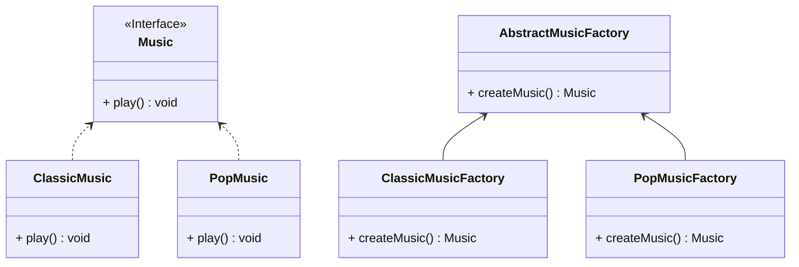

## 工厂方法

*亦称：虚拟构造函数、Virtual Constructor、Factory Method*

**工厂方法**是一种创建型设计模式，其在父类中提供一个创建对象的方法，允许子类决定实例化对象的类型。

> 如需要制作古典音乐和流行音乐，但是希望创造出来的音乐是属于同一种类的，那么如何来做呢？



步骤1：创建一个产品接口

```java
public interface Music {
    void play();
}
```

步骤2：创建实现接口的实体类

```java
public class ClassicMusic implements Music {

    @Override
    public void play() {
        System.out.println("Classical music is playing.");
    }
}

public class PopMusic implements Music {

    @Override
    public void play() {
        System.out.println("Pop music is playing.");
    }
}
```

步骤3：创建一个抽象工厂

```java
public abstract class AbstractMusicFactory {
    public abstract Music createMusic();
}
```

步骤4：创建实现抽象工厂的工厂类

```java
public class ClassicMusicFactory extends AbstractMusicFactory {

    @Override
    public Music createMusic() {
        return new ClassicMusic();
    }
}

public class PopMusicFactory extends AbstractMusicFactory {

    @Override
    public Music createMusic() {
        return new PopMusic();
    }
}
```

步骤5：通过工厂获得产品

```java
public class MainApp {
    public static void main(String[] args) {
        ClassicMusicFactory classicMusicFactory = new ClassicMusicFactory();
        classicMusicFactory.createMusic().play();
        PopMusicFactory popMusicFactory = new PopMusicFactory();
        popMusicFactory.createMusic().play();
    }
}
```