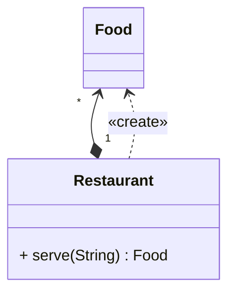

## 享元

*亦称：缓存、Cache、Flyweight*

**享元**是一种结构型设计模式，它摒弃了在每个对象中保存所有数据的方式，通过共享多个对象所共有的相同状态，让你能在有限的内存容量中载入更多对象。

> 如果你经营一家自助餐厅，每当客人点菜时，如果厨房有存货就上菜，否则就去制作，这里的“存货”就是**享元**的概念。



步骤1：创建食物实体类，我们通过打印内存地址来判断是否是同一盘食物。

```java
public class Food {
    private final String name;

    public Food(String name) {
        this.name = name;
    }

    @Override
    public String toString() {
        return name + "@" + Integer.toHexString(hashCode());
    }
}
```

步骤2：使用餐厅类来完成制作和上菜的逻辑

```java
public class Restaurant {
    private static final HashMap<String, Food> foodMap = new HashMap<>();

    public static Food serve(String name) {
        if (foodMap.containsKey(name)) {
            System.out.print("Already owned ");
            return foodMap.get(name);
        }
        System.out.print("Making ");
        Food food = new Food(name);
        foodMap.put(name, food);
        return food;
    }
}
```

步骤3：顾客点菜，餐厅依照秩序工作

```java
public class MainApp {
    public static void main(String[] args) {
        String[] menu = new String[]{"Beef", "Chicken", "Milk", "Beef", "Chicken", "Milk"};
        Arrays.stream(menu).forEach(item -> {
            System.out.print("Ordering " + item + " --> ");
            System.out.println(Restaurant.serve(item));
        });
    }
}
```


