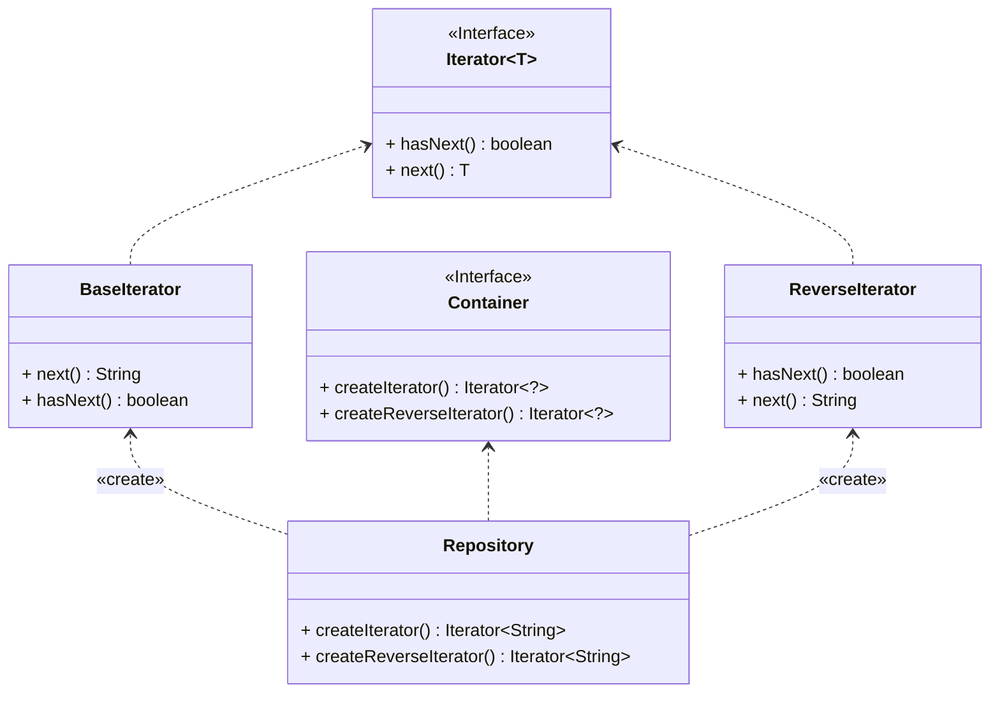

## 迭代器

*亦称：Iterator*

**迭代器**是一种行为设计模式，让你能在不暴露集合底层表现形式（列表、栈和树等）的情况下遍历集合中所有的元素。

> 如果你有一个集合类，但是却有各种各样的遍历算法(正序、反序、DFS、BFS…)，这些遍历算法最终会和你的集合耦合在一起，你将会很难添加一个新的遍历算法，而且集合类的**主要职责**难道不是高效存储元素吗？为了将**存储**和**遍历**进行**解耦**，我们可以使用**迭代器**来实现。



步骤1：创建一个迭代器接口，声明遍历所需的方法

```java
public interface Iterator<T> {
    boolean hasNext();

    T next();
}
```

步骤2：创建一个容器接口，声明获取各种迭代器的方法

```java
public interface Container {
    Iterator<?> createIterator();

    Iterator<?> createReverseIterator();
}
```

步骤3：根据迭代器接口实现各式各样的迭代方法(正序、反序、DFS、BFS…)

```java
public class BaseIterator implements Iterator<String> {
    private final List<String> collection;
    private int index = 0;

    public BaseIterator(List<String> collection) {
        this.collection = collection;
    }

    @Override
    public boolean hasNext() {
        return collection.size() > index;
    }

    @Override
    public String next() {
        String element = collection.get(index);
        index++;
        return element;
    }
}

public class ReverseIterator implements Iterator<String> {
    private final List<String> collection;
    private int index = 0;

    public ReverseIterator(List<String> collection) {
        Collections.reverse(collection);
        this.collection = collection;
    }

    @Override
    public boolean hasNext() {
        return collection.size() > index;
    }

    @Override
    public String next() {
        String element = collection.get(index);
        index++;
        return element;
    }
}
```

步骤4：在一个实现容器接口的实体类中，存储数据结构和返回各式各样的迭代器
```java
public class Repository implements Container {
    private final List<String> collection = new ArrayList<>(Arrays.asList("A", "B", "C", "D"));

    @Override
    public Iterator<String> createIterator() {
        return new BaseIterator(collection);
    }

    @Override
    public Iterator<String> createReverseIterator() {
        return new ReverseIterator(collection);
    }
}
```

步骤5：客户端可以根据获取到的各种迭代器来完成迭代任务

```java
public class MainApp {
    public static void main(String[] args) {
        Repository repository = new Repository();
        Iterator<String> iterator = repository.createIterator();
        System.out.print("Normal  iteration: ");
        while (iterator.hasNext()) {
            System.out.print(iterator.next() + " ");
        }

        System.out.print("\nReverse iteration: ");
        iterator = repository.createReverseIterator();
        while (iterator.hasNext()) {
            System.out.print(iterator.next() + " ");
        }
    }
}
```


