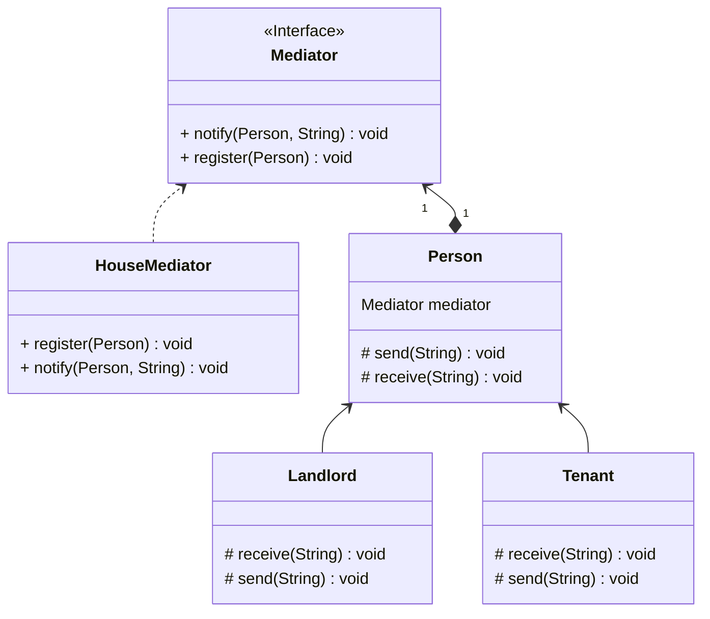

## 中介者

*亦称：调解人、控制器、Intermediary、Controller、Mediator*

**中介者**是一种行为设计模式，能让你减少对象之间混乱无序的依赖关系。该模式会限制对象之间的直接交互，迫　使它们通过一个中介者对象进行合作。

> 如果你有一套房屋想要出租，较好的方法就是通过房屋中介进行出租，可以减少你和租户的沟通。




步骤1：创建一个中介者接口，提供注册用户和通知用户的功能

```java
public interface Mediator {
    void register(Person person);

    void notify(Person person, String message);
}
```

步骤2：创建一个抽象类，规定用户有发送和接收消息的功能

```java
public abstract class Person {
    protected String name;
    protected Mediator mediator;

    public Person(String name) {
        this.name = name;
    }

    protected abstract void send(String message);

    protected abstract void receive(String message);

    public void setMediator(Mediator mediator) {
        this.mediator = mediator;
    }
}
```

步骤3：在具体的房屋中介类中实现注册和通知功能

```java
public class HouseMediator implements Mediator {
    private final List<Person> users = new ArrayList<>();

    @Override
    public void register(Person person) {
        person.setMediator(this);
        users.add(person);
    }

    @Override
    public void notify(Person person, String message) {
        for (Person user : users) {
            if (!user.equals(person)) {
                user.receive(message);
            }
        }
    }
}
```

步骤4：继承于抽象类，实现房东和租户类

```java
public class Landlord extends Person {

    public Landlord(String name) {
        super(name);
    }

    @Override
    protected void send(String message) {
        System.out.println(name + " send: " + message);
        mediator.notify(this, message);
    }

    @Override
    protected void receive(String message) {
        System.out.println(name + " receive: " + message);
    }
}

public class Tenant extends Person {

    public Tenant(String name) {
        super(name);
    }

    @Override
    protected void send(String message) {
        System.out.println(name + " send: " + message);
        mediator.notify(this, message);
    }

    @Override
    protected void receive(String message) {
        System.out.println(name + " receive: " + message);
    }
}
```

步骤5：通过中介者，已注册用户的消息可以被其他用户收到

```java
public class MainApp {
    public static void main(String[] args) {
        Mediator houseMediator = new HouseMediator();
        Landlord landlord = new Landlord("Landlord");
        Tenant tenantA = new Tenant("TenantA");
        Tenant tenantB = new Tenant("TenantB");
        houseMediator.register(landlord);
        houseMediator.register(tenantA);
        houseMediator.register(tenantB);
        landlord.send("I have two houses for rent.");
        tenantA.send("I'd like to rent one of them.");
    }
}
```


