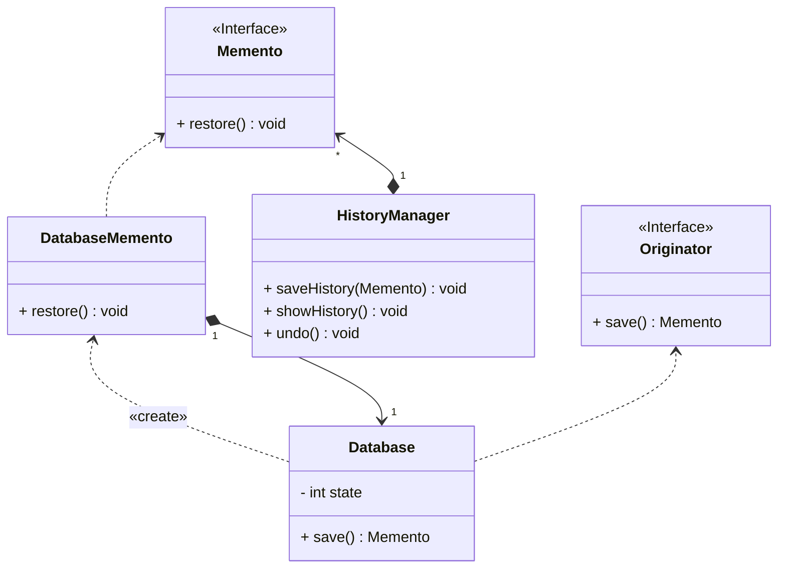

## 备忘录

*亦称：快照、Snapshot、Memento*

**备忘录**是一种行为设计模式，允许在不暴露对象实现细节的情况下保存和恢复对象之前的状态。

> 如果你有一个简易的数据库，你想为其添加一个存档功能以便发生故障时可以进行恢复，那么你可以使用备忘录来实现。




步骤1：创建一个发起人接口，提供一个存储功能

```java
public interface Originator {
    Memento save();
}
```

步骤2：创建一个备忘录接口，提供一个恢复数据功能

```java
public interface Memento {
    void restore();
}
```

步骤3：使用数据库类Originator接口

> 核心方法save将自身引用和状态作为Memento进行保存

```java
public class Database implements Originator {
    private int state;

    @Override
    public Memento save() {
        return new DatabaseMemento(this, state);
    }

    public void setState(int state) {
        this.state = state;
    }

    public int getState() {
        return state;
    }

    @Override
    public String toString() {
        return "Database{" +
                "state=" + state +
                '}';
    }
}
```

步骤4：创建一个实现Memento的数据库备份类，用于恢复数据库状态

```java
public class DatabaseMemento implements Memento {
    private final Database database;
    private final LocalDateTime date;
    private final int state;

    public DatabaseMemento(Database database, int state) {
        this.database = database;
        this.state = state;
        this.date = LocalDateTime.now();
    }

    @Override
    public void restore() {
        database.setState(state);
    }

    @Override
    public String toString() {
        return "Memento{" +
                "database=" + database +
                ", date=" + date +
                ", history=" + state +
                '}';
    }
}

```

步骤5：创建一个主管类(Caretaker)，用于添加存档和进行回滚操作

```java
public class HistoryManager {
    private final ArrayList<Memento> history = new ArrayList<>();

    public void saveHistory(Memento memento) {
        history.add(memento);
    }

    public void showHistory() {
        for (Memento memento : history) {
            System.out.println(memento);
        }
    }

    public void undo() {
        if (history.size() <= 1) {
            System.out.println("HistoryManager doesn't has history.");
            return;
        }
        int index = history.size() - 1;
        history.get(index - 1).restore();
        history.remove(index);
    }
}
```

步骤6：使用历史管理器(caretaker)进行存档和回滚

```java
public class MainApp {
    public static void main(String[] args) {
        Database database = new Database();
        HistoryManager historyManager = new HistoryManager();

        database.setState(1);
        historyManager.saveHistory(database.save());
        database.setState(2);
        historyManager.saveHistory(database.save());
        database.setState(3);
        historyManager.saveHistory(database.save());

        historyManager.showHistory();
        historyManager.undo();
        historyManager.undo();
        System.out.println("Undo two operations");
        historyManager.showHistory();
    }
}

```


