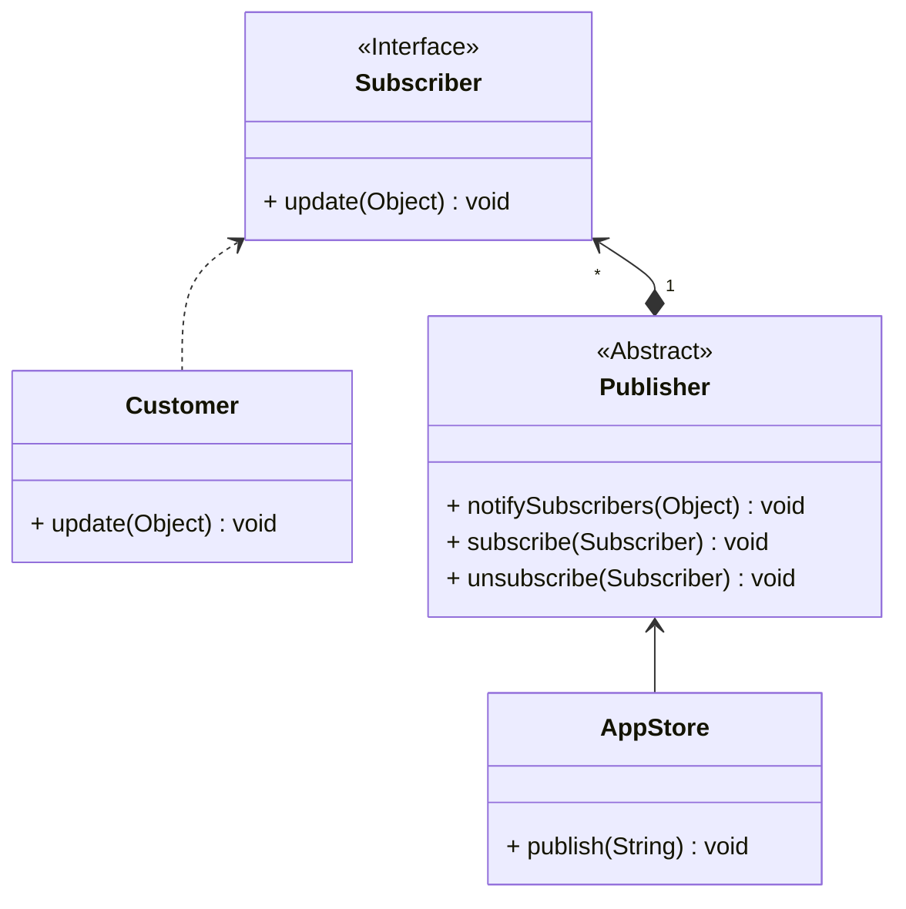

## 观察者

*亦称：事件订阅者、监听者、Event-Subscriber、Listener、Observer*

**观察者**是一种行为设计模式，允许你定义一种订阅机制，可在对象事件发生时通知多个“观察”该对象的其他对象。

> 如果你正在开发一款应用，每次发布都需要通知用户。但有的用户并不想收到通知，有的用户又希望及时收到通知，那么有一种解决方案称为观察者模式。



步骤1：声明一个订阅者接口，提供一个收到通知的方法

```java
public interface Subscriber {
    void update(Object context);
}
```

步骤2：创建一个发布者抽象类，提供添加和删除订阅者、发布通知的功能

```java
public abstract class Publisher {
    private final ArrayList<Subscriber> subscribers = new ArrayList<>();

    public void subscribe(Subscriber subscriber) {
        subscribers.add(subscriber);
    }

    public void unsubscribe(Subscriber subscriber) {
        subscribers.remove(subscriber);
    }

    public void notifySubscribers(Object context) {
        for (Subscriber subscriber : subscribers) {
            subscriber.update(context);
        }
    }
}
```

步骤3：使应用商店继承于发布者类，使用父类方法来完成通知功能

```java
public class AppStore extends Publisher {
    public void publish(String context){
        System.out.println(context);
        notifySubscribers(context);
    }
}
```

步骤4：创建一个实现Subscriber的顾客类，实现收到通知的方法

```java
public class Customer implements Subscriber {
    private final String name;

    public Customer(String name) {
        this.name = name;
    }

    @Override
    public void update(Object context) {
        System.out.println(name + " receive: " + context);
    }
}
```

步骤5：使用订阅、退订和发布的功能

```java
public class MainApp {
    public static void main(String[] args) {
        AppStore appStore = new AppStore();
        Customer customerA = new Customer("Customer A");
        Customer customerB = new Customer("Customer B");
        Customer customerC = new Customer("Customer C");
        appStore.subscribe(customerA);
        appStore.subscribe(customerB);
        appStore.subscribe(customerC);
        appStore.publish("Appstore published the first message.");
        appStore.unsubscribe(customerC);
        appStore.publish("Appstore published the second message.");
    }
}
```


