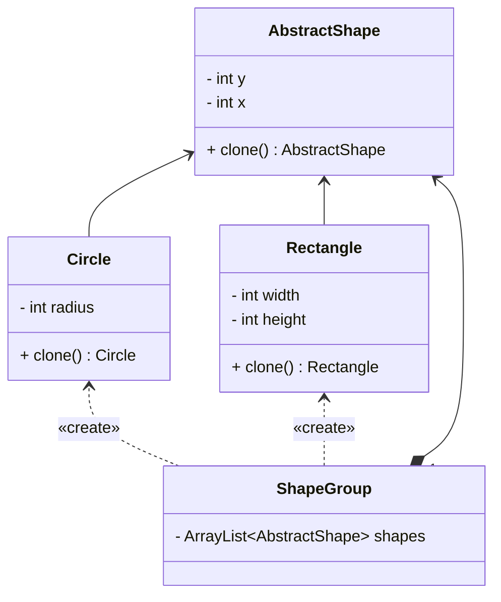

## 原型

*亦称：克隆、Clone、Prototype*

**原型**是一种创建型设计模式，使你能够复制已有对象，而又无需使代码依赖它们所属的类。

> 如需要根据对象来克隆一个相同的对象，但是又不想了解其所属的类别，克隆是一把好手。



步骤1：创建一个抽象父类，在其中定义一个抽象clone方法

```java
public abstract class AbstractShape {
    private int x;
    private int y;

    public AbstractShape() {
    }

    public AbstractShape(AbstractShape source) {
        this.x = source.x;
        this.y = source.y;
    }

    @Override
    public abstract AbstractShape clone();

    public void setX(int x) {
        this.x = x;
    }

    public void setY(int y) {
        this.y = y;
    }

}
```

步骤2：创建继承于抽象类的实体类，重点其可以根据当前对象创建一个新对象。

> 具体实现于有参构造函数(注意需要继承父类的属性)和clone方法

```java
public class Circle extends AbstractShape {
    private int radius;

    public Circle() {
    }

    public Circle(Circle source) {
        super(source);
        this.radius = source.radius;
    }

    @Override
    public Circle clone() {
        return new Circle(this);
    }

    public void setRadius(int radius) {
        this.radius = radius;
    }

    @Override
    public String toString() {
        return "Circle{" +
                "radius=" + radius +
                '}';
    }
}
```

步骤3：可以创建一个**原型组**在其中初始化一系列原型(可选)

```java
public class ShapeGroup {
    private final ArrayList<AbstractShape> shapes = new ArrayList<>();

    public ShapeGroup() {
        Circle circle = new Circle();
        circle.setX(10);
        circle.setY(10);
        circle.setRadius(20);
        shapes.add(circle);

        Rectangle rectangle = new Rectangle();
        rectangle.setWidth(10);
        rectangle.setHeight(20);
        shapes.add(rectangle);
    }

    public ArrayList<AbstractShape> getShapes() {
        return shapes;
    }
}
```

步骤4：使用原型进行克隆

```java
public class MainApp {

    public static void main(String[] args) {
        ShapeGroup shapeGroup = new ShapeGroup();
        ArrayList<AbstractShape> shapes = shapeGroup.getShapes();
        ArrayList<AbstractShape> shapesCopy = new ArrayList<>();

        for (AbstractShape shape : shapes) {
            shapesCopy.add(shape.clone());
        }
        shapes.forEach(System.out::println);
        shapesCopy.forEach(System.out::println);
    }
}
```


