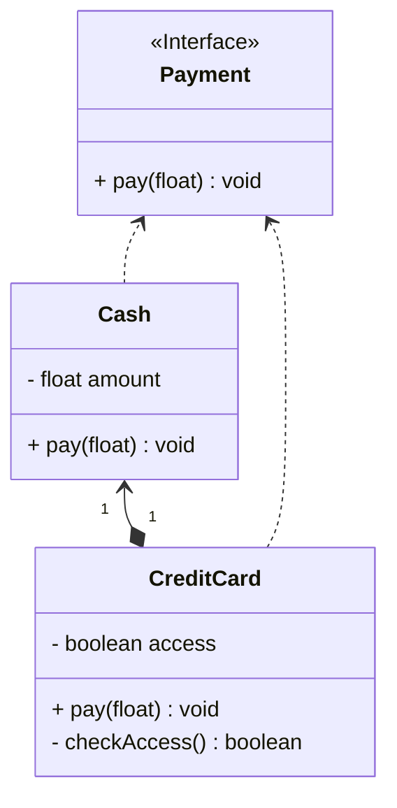

## 代理

*亦称：Proxy*

**代理**是一种结构型设计模式，让你能够提供对象的替代品或其占位符。代理控制着对于原对象的访问，并允许在将请求提交给对象前后进行一些处理。

> 如果你不想每次出门购物都带大量现金，那么银行卡(代理)是一个不错的主意。



步骤1：创建一个支付接口，实体类和代理都需要实现它

```java
public interface Payment {
    void pay(float price);
}
```

步骤2：创建具体的零钱类，完成支付功能

```java
public class Cash implements Payment {
    private float amount = 100;

    @Override
    public void pay(float price) {
        amount = amount - price;
    }

    public float getAmount() {
        return amount;
    }

    @Override
    public String toString() {
        return "Cash has " + amount + ".";
    }
}
```

步骤3：创建一个代理类(信用卡)，使用它来维护零钱，同时还可以添加“是否可用”功能

```java
public class CreditCard implements Payment {
    private final Cash cash;
    private boolean access = true;

    public CreditCard(Cash cash) {
        this.cash = cash;
    }

    @Override
    public void pay(float price) {
        if (checkAccess()) {
            cash.pay(price);
        } else {
            System.out.println("This CreditCard is not available.");
        }
    }

    private boolean checkAccess() {
        return access;
    }

    public void setAccess(boolean access) {
        this.access = access;
    }

    @Override
    public String toString() {
        return "CreditCard has " + cash.getAmount() + ".";
    }
}
```

步骤4：使用代理类来完成业务逻辑，同时还可以补充一些控制功能

    public class MainApp {
        public static void main(String[] args) {
            CreditCard creditCard = new CreditCard(new Cash());
            creditCard.pay(30);
            System.out.println(creditCard);
            creditCard.setAccess(false);
            // Error! This CreditCard is not available.
            creditCard.pay(10);
        }
    }

