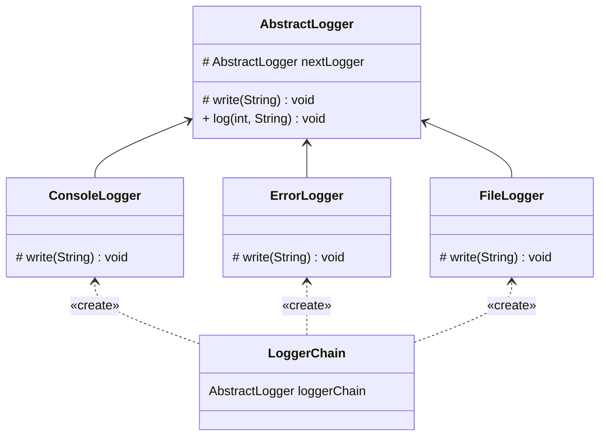

## 责任链

*亦称：职责链模式、命令链、CoR、Chain of Command、Chain of Responsibility*

**责任链**是一种行为设计模式，允许你将请求沿着处理者链进行发送。收到请求后，每个处理者均可对请求进行处理，或将其传递给链上的下个处理者。

> 如果你想实现一个对于不同级别的信息，输出级别是不同的**Logger**，那么可以考虑使用责任链。



步骤1：创建一个抽象日志类，提供基础的信息和功能

> 注意：成员变量nextLogger负责存储下一个logger的引用地址

```java
public abstract class AbstractLogger {
    public static final int INFO = 1;
    public static final int DEBUG = 2;
    public static final int ERROR = 3;
    protected int level;
    protected AbstractLogger nextLogger;

    public void setNextLogger(AbstractLogger nextLogger) {
        this.nextLogger = nextLogger;
    }

    abstract protected void write(String message);

    public void log(int level, String message) {
        if (this.level <= level) {
            write(message);
        }
        if (nextLogger != null) {
            nextLogger.log(level, message);
        }
    }
}
```

步骤2：创建不同级别的具体日志类

```java
public class ConsoleLogger extends AbstractLogger {

    public ConsoleLogger(int level) {
        this.level = level;
    }

    @Override
    protected void write(String message) {
        System.out.println("Standard Console::Logger: " + message);
    }
}

public class ErrorLogger extends AbstractLogger {

    public ErrorLogger(int level) {
        this.level = level;
    }

    @Override
    protected void write(String message) {
        System.out.println("Error Console::Logger: " + message);
    }
}

public class FileLogger extends AbstractLogger {

    public FileLogger(int level) {
        this.level = level;
    }

    @Override
    protected void write(String message) {
        System.out.println("File::Logger: " + message);
    }
}
```

步骤3：通过成员变量nextLogger将各个logger连接起来

> 可以考虑实现一个addFilter方法来动态添加logger

```java
public class LoggerChain {
    public static AbstractLogger getLoggerChain() {
        AbstractLogger errorLogger = new ErrorLogger(AbstractLogger.ERROR);
        AbstractLogger fileLogger = new FileLogger(AbstractLogger.DEBUG);
        AbstractLogger consoleLogger = new ConsoleLogger(AbstractLogger.INFO);

        errorLogger.setNextLogger(fileLogger);
        fileLogger.setNextLogger(consoleLogger);
        return errorLogger;
    }
}
```

步骤4：使用责任链来根据不同级别的信息，输出不同的日志记录

```java
public class MainApp {
    public static void main(String[] args) {
        AbstractLogger logger = LoggerChain.getLoggerChain();

        logger.log(AbstractLogger.INFO, "This is an information.");

        logger.log(AbstractLogger.DEBUG, "This is a debug level information.");

        logger.log(AbstractLogger.ERROR, "This is an error information.");
    }
}
```


