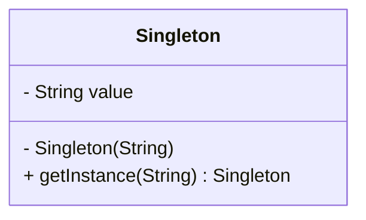

## 单例

*亦称：单件模式、Singleton*

**单例**是一种创建型设计模式，让你能够保证一个类只有一个实例，并提供一个访问该实例的全局节点。

> 如果你的系统中只想拥有某个类的一个实例，并且这个实例是全局可用的，那么单例是最适合的解决方案。



步骤1：创建一个单例类

> - 构造函数必须是private的，且instance必须是一个类变量
> - 同时提供一个名为getInstance的类方法对外暴露出实例
> - 注意thread-safe、懒汉/饿汉模式

```java
public final class Singleton {
    /**
     * The field must be declared volatile 
     * so that double check lock would work correctly.
     */
    private static volatile Singleton instance;
    private final String value;

    private Singleton(String value) {
        this.value = value;
    }

    /**
     * double-checked locking (DCL)
     * threads safe
     */
    public static Singleton getInstance(String value) {
        if (instance != null) {
            return instance;
        }
        synchronized (Singleton.class) {
            if (instance == null) {
                instance = new Singleton(value);
            }
            return instance;
        }
    }

    public String getValue() {
        return value;
    }
}
```

步骤2：使用单例

> 注意两个instance的地址是相同的，说明他们是同一个instance，也就是**单例**

```java
public class MainApp {
    public static void main(String[] args) {
        Singleton instance = Singleton.getInstance("instance No.1");
        System.out.println(instance);
        System.out.println(instance.getValue());

        // The obtained instance is still instance No.1, 
        // and they have the same memory address.
        instance = Singleton.getInstance("instance No.2");
        System.out.println(instance);
        System.out.println(instance.getValue());
    }
}
```
