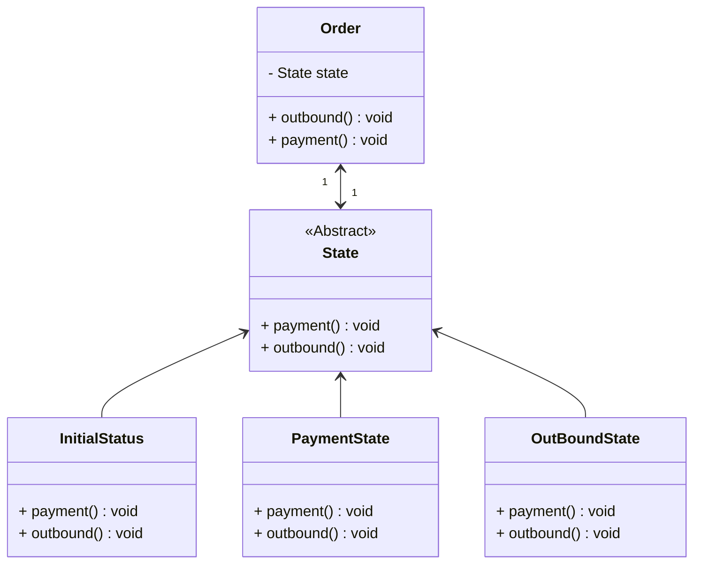

## 状态

*亦称：State*

状态是一种行为设计模式，让你能在一个对象的内部状态变化时改变其行为，使其看上去就像改变了自身所属的类一样。

> 如果你在设计一个电商平台，订单含有多个状态(初始、审核、支付、出库、完成…)，为了避免大量的if，状态模式是一把利刃。



步骤1：创建一个抽象状态类，在其中保存Order对象的引用

```java
public abstract class State {
    protected Order order;

    public State(Order order) {
        this.order = order;
    }

    public abstract void payment();

    public abstract void outbound();
}

```

步骤2：创建订单实体类，在其中保存State对象的引用

```java
public class Order {
    private State state;

    public void setState(State state) {
        this.state = state;
    }

    public void payment() {
        state.payment();
    }

    public void outbound() {
        state.outbound();
    }
}
```

步骤3：继承于抽象类，实现具体状态(初始、支付、出库)

```java
public class InitialStatus extends State {

    public InitialStatus(Order order) {
        super(order);
    }

    @Override
    public void payment() {
        order.setState(new PaymentState(order));
        System.out.println("Successful payment");
    }

    @Override
    public void outbound() {
        System.out.println("Failure outbound");
    }
}

public class PaymentState extends State {
    public PaymentState(Order order) {
        super(order);
    }

    @Override
    public void payment() {
        System.out.println("Has already payment");
    }

    @Override
    public void outbound() {
        order.setState(new OutBoundState(order));
        System.out.println("Successful outbound");
    }
}

public class OutBoundState extends State {
    public OutBoundState(Order order) {
        super(order);
    }

    @Override
    public void payment() {
        System.out.println("Has already payment");
    }

    @Override
    public void outbound() {
        System.out.println("Has already outbound");
    }
}
```

步骤4：通过状态模式可以很方便的管理状态，甚至不需要写一行if语句

```java
public class MainApp {
    public static void main(String[] args) {
        Order order = new Order();
        order.setState(new InitialStatus(order));
        // failure: Payment is required in advance
        order.outbound();
        // ok
        order.payment();
        // ok
        order.outbound();
        // failure: has already outbound
        order.outbound();
    }
}
```


