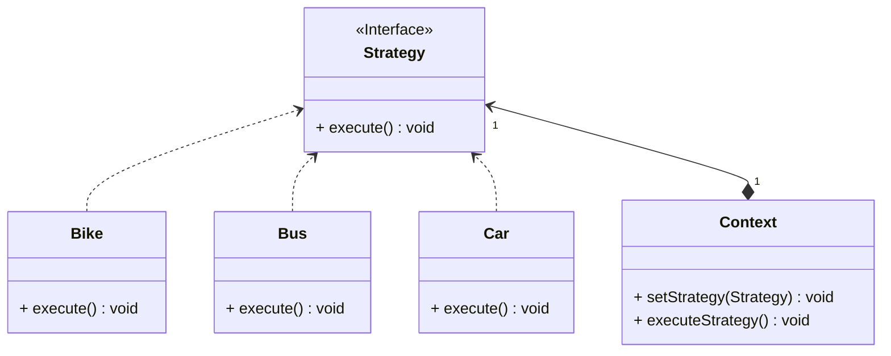

## 策略

*亦称：Strategy*

**策略**是一种行为设计模式，它能让你定义一系列算法，并将每种算法分别放入独立的类中，以使算法的对象能够相互替换。

> 如果你开发了一款汽车导航APP，几个月后，APP大受欢迎，用户想要添加自行车路线规划的功能。又过了几周，用户又想添加公共汽车路线规划的功能…此时的导航系统越发臃肿，较好的改进方法是使用策略模式。



步骤1：创建一个策略接口供上下文调用执行策略的方法

```java
public interface Strategy {
    void execute();
}
```

步骤2：实现具体的路径规划策略(轿车、自行车、公共汽车…)

```java
public class Bike implements Strategy {
    @Override
    public void execute() {
        System.out.println("It takes 3 hours to get to the destination by bike.");
    }
}

public class Car implements Strategy {
    @Override
    public void execute() {
        System.out.println("It takes 40 minutes to get to the destination by car.");
    }
}

public class Bus implements Strategy {
    @Override
    public void execute() {
        System.out.println("It takes 2 hours to get to the destination by bus.");
    }
}
```

步骤3：创建一个上下文类，在其中设置策略和执行策略

```java
public class Context {
    private Strategy strategy;

    public void setStrategy(Strategy strategy) {
        this.strategy = strategy;
    }

    public void executeStrategy() {
        strategy.execute();
    }
}
```

步骤4：通过策略模式灵活的切换出行策略

```java
public class MainApp {
    public static void main(String[] args) {
        Context context = new Context();
        context.setStrategy(new Bike());
        context.executeStrategy();
        context.setStrategy(new Bus());
        context.executeStrategy();
        context.setStrategy(new Car());
        context.executeStrategy();
    }
}
```


