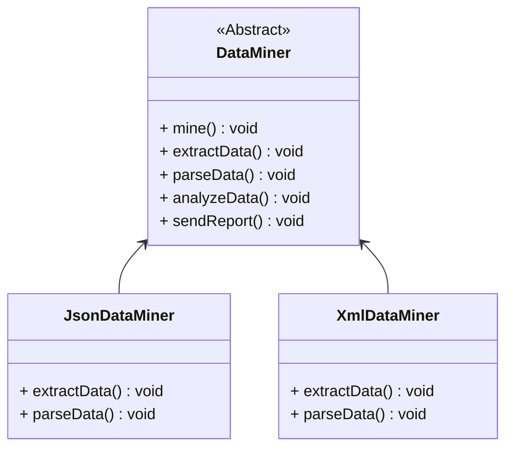

## 模板方法

*亦称：Template Method*

**模板方法**是一种行为设计模式，它在超类中定义了一个算法的框架，允许子类在不修改结构的情况下重写算法的特定步骤。 

> 如果你在执行一项数据挖掘的任务，你需要抽取解析各种格式的文件，然后进行分析报告。在这项任务中，除了最开始抽取和解析数据的步骤依赖于具体的文件格式，其他步骤几乎是相同的。基于此，将这项任务抽象为模板方法似乎是一个不错的主意。



步骤1：创建一个抽象数据挖掘类，在其中声明模板方法以及一系列默认和抽象的方法

> - 将需要执行的步骤列在模板方法中，本例中为mine()
> - 声明模板方法的修饰符为final，避免子类重写该方法
> - 子类必须重写抽象方法
> - 子类可以重写默认方法(可选)

```java
public abstract class DataMiner {
    public final void mine() {
        extractData();
        parseData();
        analyzeData();
        sendReport();
    }

    public abstract void extractData();

    public abstract void parseData();

    public void analyzeData() {
        System.out.println("Analyzing...");
    }

    public void sendReport() {
        System.out.println("Reporting...");
    }
}
```

步骤2：创建JSON格式的数据挖掘器，实现JSON格式的数据抽取和解析

```java
public class JsonDataMiner extends DataMiner {
    @Override
    public void extractData() {
        System.out.println("Extracting JSON...");
    }

    @Override
    public void parseData() {
        System.out.println("Parsing JSON...");
    }
}
```

步骤3：创建XML格式的数据挖掘器，实现XML格式的数据抽取和解析

```java
public class XmlDataMiner extends DataMiner {
    @Override
    public void extractData() {
        System.out.println("Extracting XML...");
    }

    @Override
    public void parseData() {
        System.out.println("Parsing XML...");
    }
}
```

步骤4：使用模板方法完成数据挖掘的任务

```java
public class MainApp {
    public static void main(String[] args) {
        DataMiner jsonDataMiner = new JsonDataMiner();
        jsonDataMiner.mine();
        DataMiner xmlDataMiner = new XmlDataMiner();
        xmlDataMiner.mine();
    }
}
```


