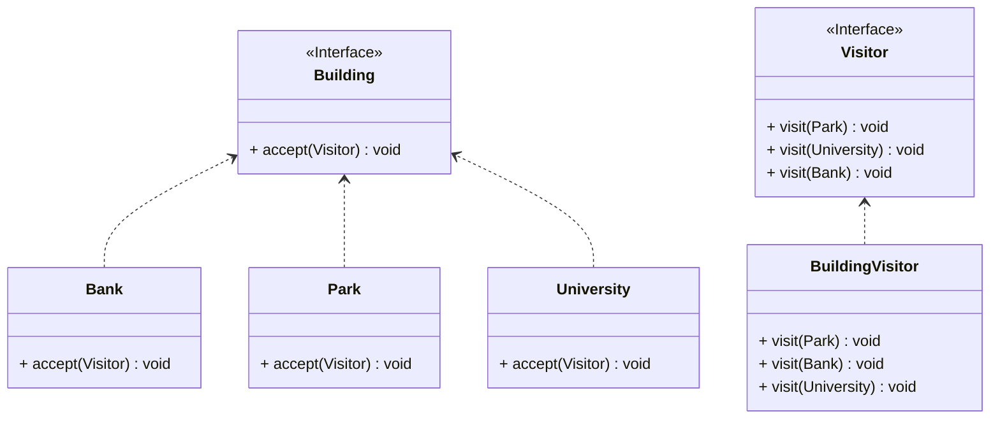

## 访问者

*亦称：visitor*

**访问者**是一种行为设计模式，它能将算法与其所作用的对象隔离开来。

> 世界上有很多建筑物每天都在发挥他们各自的作用。突然有一天，一群本地学生想要参观这些存在了数十年的建筑物。又过了一段时间，一群外地游客又想要参观这些建筑物。难道要在稳定工作的建筑物中增加供各种访问者访问的方法吗？这很容易造成建筑物无法正常使用，而使用访问者模式可以将**参观**这种日新月异的方法与稳定存在的建筑物隔离开。



步骤1：在建筑物接口中增加一个accept方法用于接受访问者对象

```java
public interface Building {
    void accept(Visitor visitor);
}
```

步骤2：声明访问者接口，其可以访问各种各样的建筑物

```java
public interface Visitor {
    void visit(Park park);

    void visit(Bank bank);

    void visit(University university);
}
```

步骤3：在各个开放访问的建筑物中实现accept方法

```java
public class Park implements Building {
    @Override
    public void accept(Visitor visitor) {
        visitor.visit(this);
    }
}

public class Bank implements Building {
    @Override
    public void accept(Visitor visitor) {
        visitor.visit(this);
    }
}

public class University implements Building {
    @Override
    public void accept(Visitor visitor) {
        visitor.visit(this);
    }
}
```

步骤4：在建筑物访问者中实现访问各种建筑物的方法

> 不支持类型重载的编程语言需要将访问方法重命名
>
> 今后若有新的访问者类，仅仅需要重写一个实现Vistor接口的类

```java
public class BuildingVisitor implements Visitor {
    @Override
    public void visit(Park park) {
        System.out.println("The visitors visited the park.");
    }

    @Override
    public void visit(Bank bank) {
        System.out.println("The visitors visited the bank.");
    }

    @Override
    public void visit(University university) {
        System.out.println("The visitors visited the university.");
    }
}
```
步骤5：通过访问者来参观各个建筑物

```java
public class MainApp {
    public static void main(String[] args) {
        Building[] buildings = new Building[]{new Park(), new Bank(), new University()};
        BuildingVisitor buildingVisitor = new BuildingVisitor();
        for (Building building : buildings) {
            building.accept(buildingVisitor);
        }
    }
}
```
